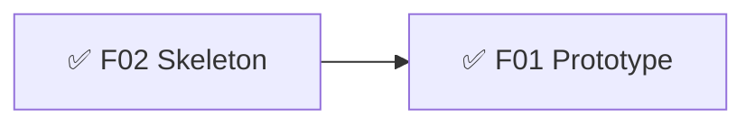
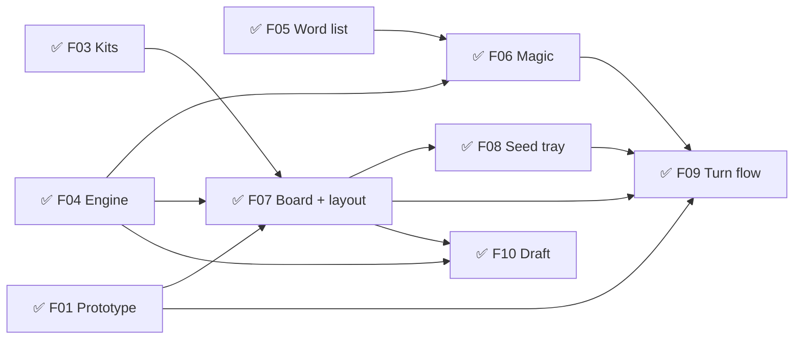
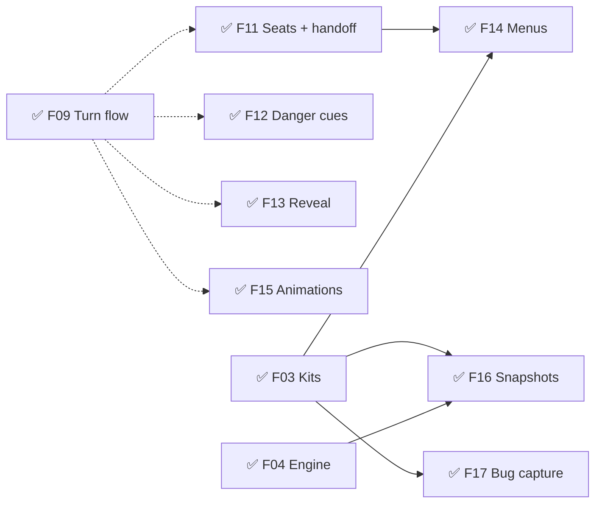
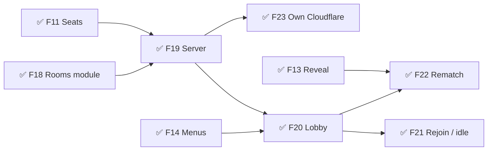
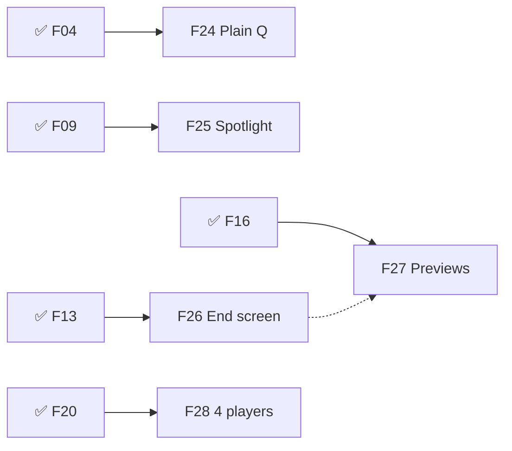

# Glyphtender — Roadmap
Release target: beta — musts not set (/define) · alpha — released 2026-09-30 (v0.1.0) · online added 2026-10-01 (v0.2.0) · polish 2026-10-03 (v0.3.0)
IDs are names, not build order — follow `needs:`.

## v0.1 — Sketch  ✅ done 2026-09-30
Goal: Muzzy moves a glyphling, casts a seed, undoes, and does it again — on his phone both ways up and on desktop — and decides how committing a turn should feel.
- ✅ F02 🧱 Project skeleton — must:alpha · sprint 1
  what: Vite + React + TS, vitest, GitHub Pages deploy, PWA, phone-on-Wi-Fi dev link, Dev Kit (Console, Tuning, Color)
- ✅ F01 ❓ Prototype: move → cast → undo (code sketch) — must:alpha · needs: F02 · sprint 1
  answer: One Cast + undo; throw story + one halo style for planned pieces (GDD §4, TDD D08)
  what: both boards, night mood, stand-in art, tap + drag, undo / tap-again, a "Cast" button; no scoring, no turns. Lives in `sketches/`, thrown away after.
  why: answers *Try freely, commit once* and *Always readable* (can you read 117 hexes on a phone?) before the turn flow is built on them

## v0.2 — Plant a garden  ✅ released 2026-09-30 (alpha v0.1.0)
Goal: two players on one device draft, move, cast, grow words and make Magic on either board.
- ✅ F03 🧱 UI kit (Cozy, night colours) — must:alpha · needs: F02 · sprint 2
- ✅ F04 🧱 Rules engine: boards, draft, move/cast legality, bag (120 + Qu), tangles, game end, tangle bonus — must:alpha · needs: F02 · sprint 2
- ✅ F05 🧱 Official word list + word finder (union rule, Qu, min length) — must:alpha · needs: F02 · sprint 2
- ✅ F06 🧱 Magic + draw / refresh — must:alpha · needs: F04, F05 · sprint 2
- ✅ F07 🧱 Board view + layout shell (tall → stacked, wide → side tray; fit / zoom) — must:alpha · needs: F01, ~F03, F04 · sprint 3
- ✅ F08 🎮 Seed tray (tap + drag, reorder, shuffle, refresh mode) — must:alpha · needs: F07 · sprint 3
  why: seeds always in reach, refresh never a dead turn → avoids "homework" turns
- ✅ F09 🎮 Turn flow (legal highlights, move, cast, undo, "Cast · +N", words outlined, throw + sprout, piece-state look from F01) — must:alpha · needs: F01, F06, F07, F08 · sprint 3
  why: every legal option lit + live Magic preview → players hunt for two-birds casts → Cozy cleverness
- ✅ F10 🎮 Snake draft — must:alpha · needs: F07, F04 · sprint 3
  why: fair openings, no lockout → Fellowship

## v0.3 — A full pass-and-play game  ✅ released 2026-09-30 (alpha v0.1.0)
Goal: 2–4 friends play a complete game on one phone, from the main menu to the Magic reveal, without seeing each other's seeds.
- ✅ F11 🧱 Seats + "pass to Blue" handoff screen — must:alpha · needs: ~F09 · sprint 4
  why: seeds stay secret on one device → Fellowship without peeking; seats let online + AI plug in later
- ✅ F12 🎮 Tangle danger cues — must:alpha · needs: ~F09 · sprint 4
  why: shows risk instead of scores → Secret-Magic tension stays, board stays readable
- ✅ F13 🎮 Magic reveal + end table + play again — must:alpha · needs: ~F09 · sprint 4
  why: staged reveal (bonuses pop, totals count up lowest-first) → the gasp at the end → Secret-Magic tension
- ✅ F14 🎮 Menus: main, new game (players, board, 2-letter), settings, pause — must:alpha · needs: F03, F11 · sprint 4
- ✅ F15 ✨ Grow + move animations (basic) — must:alpha · needs: ~F09 · sprint 5
  why: a pause to see what grew → *A cozy garden*, everyone follows the move
- ✅ F16 🔧 Dev Kit Snapshots — save/restore any board position (framework-first) — must:alpha · needs: F03, F04 · sprint 4
- ✅ F17 🔧 Dev Kit Bug capture (framework-first) — must:alpha · needs: F03 · sprint 4

## v0.4 — Play online  ✅ released 2026-10-01 (v0.2.0)
Goal: 2–4 players on different devices join by room code and play a full game; seeds and Magic stay secret.
- ✅ F18 🧱 Framework "rooms" module — harvested from Roll Better (create/join, identity, rejoin, host migration) — must:alpha · sprint 5
- ✅ F19 🧱 Online server: same engine, per-player views (`design/online.md` first) — must:alpha · needs: F11, F18 · sprint 5
- ✅ F20 🎮 Create / join a room, 2–4 players (kit Lobby) — must:alpha · needs: F19, ~F14 · sprint 5
  why: play with friends anywhere → Fellowship
- ✅ F21 🎮 Rejoin, host leaves, idle players — must:alpha · needs: F20
- ✅ F22 🎮 Rematch — must:alpha · needs: F20, ~F13
- ✅ F23 🧱 Online server on Muzzy's own Cloudflare (PartyServer + wrangler — TDD D46) — must:alpha · needs: F19

## v0.5 — Polish: the ending, the Q, the words  ✅ released 2026-10-03 (v0.3.0)
Goal: the end of a game is worth looking at, every word is readable, the Q is honest, 4 players work everywhere, and any gated screen can be previewed from the Dev Kit.
- ✅ F24 🎮 Q is a plain Q; bag U4→U5, E16→E15 (stays 120) — must:alpha · needs: F04, F05 · sprint 7
- ✅ F25 ✨ Word spotlight: after a cast, each scored word lights up one at a time, looping until play moves on — must:alpha · needs: F09 · sprint 7
- ✅ F26 🎮 Game log + end screen overhaul: big scores, breakdowns (solo words, word lengths, tangles, refreshes, multi-word turns), score-over-time chart with moments, 2–4 players — must:alpha · needs: F13 · sprint 7
  why: the ending tells the story of the game → Secret-Magic tension, Fellowship ("again?")
- ✅ F27 🔧 Dev Kit Screen previews: open any gated screen/state (end screen 2/3/4p, reveal, handoff, lobby…) with sample data, sandboxed — never touches the real game — must:alpha · needs: F16, ~F26 · sprint 7
- ✅ F28 🧪 4 players everywhere: pass-and-play + online 4-player checked end to end, fixes — must:alpha · needs: F11, F20 · sprint 7

## Later
- **beta (AI) — waits until Muzzy can sit down and describe it (2026-10-01):** framework AI module from the original's goal-selection model (`research/original-digest.md §2`) · 7 personalities with bios + gentle banter · AI in any seat, 2–4 players, online idle takeover · AI at human pace + speed setting · Dev Kit AI tool (AI-vs-AI, personality sliders) · basic audio · sims: board size per player count, bag run-out, first-player edge · **Re-tune award thresholds with AI personalities (AI-vs-AI)** (the 14 skill awards' thresholds are provisional — research/sims.md 2026-10-02) · ❓ AI vocabulary tiers (Zipf 3/2/0 vs 4/3/0) · ❓ Strategist personality
- **1.0:** tutorial · accessibility pass · Muzzy's final art + board art · audio pass · lifetime stats screen + Wordsmith/Tanglesmith radar · credits + privacy · ❓ word list licence (keep + permission, or re-run the Zipf pipeline on a free base)
- **Should:** board themes · colour preference · random starting player · hint · topiary-grow cast effect
- **Could:** async play · spectators · leaderboards/accounts · 3D figurine glyphlings

## Ideas
- 2026-09-30 — Magic sparkles that pop against the night garden (Muzzy)
- 2026-09-30 — Signature cast: seed arcs → buried → glyphling splashes magic water → topiary letter grows (from the original's HANDOFF §11.2)
- 2026-09-30 — Harvest candidates for the framework once proven here: seed tray (tile rack), hex board viewport (fit/zoom), drag-to-slot
