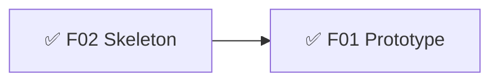
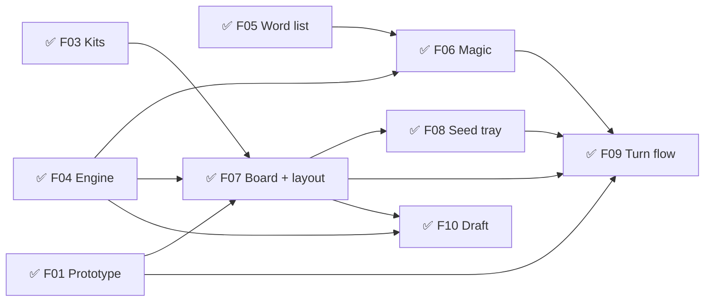
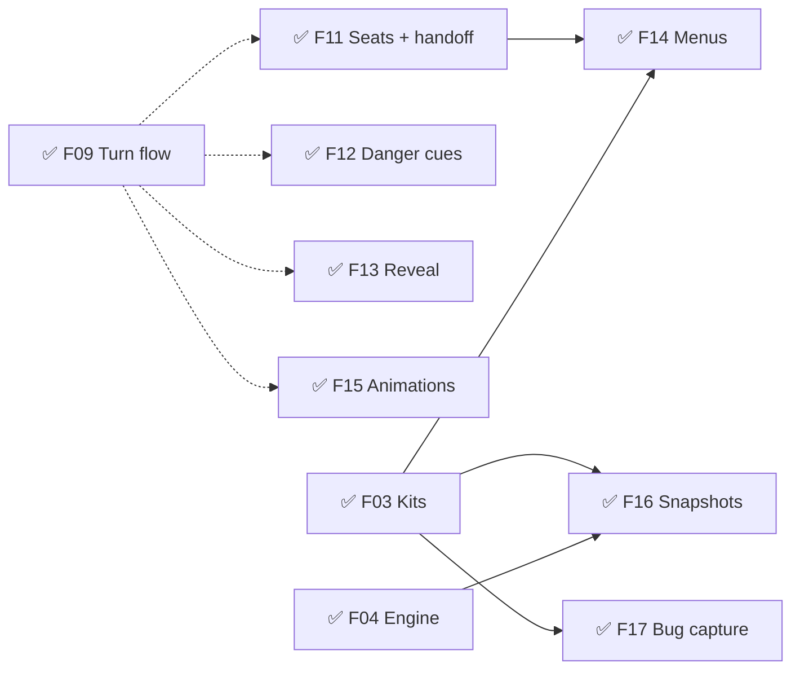
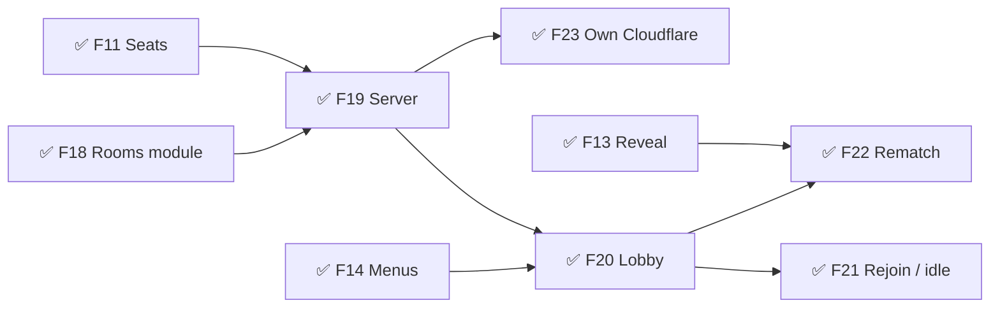
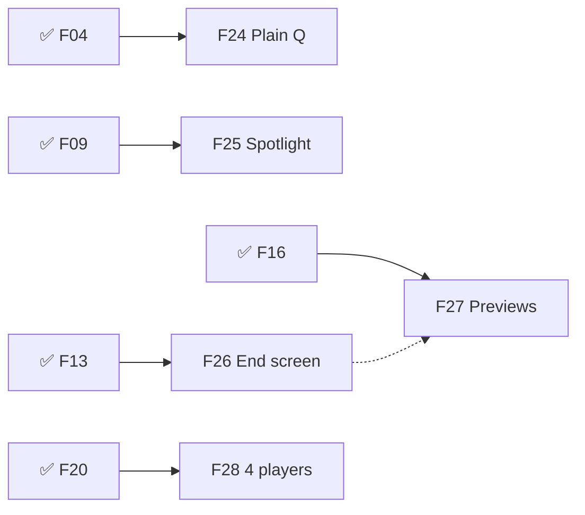
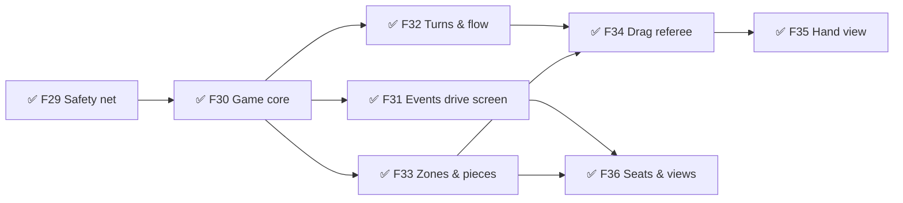
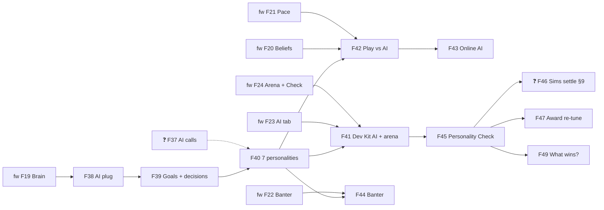

# Glyphtender — Roadmap
Release target: beta — AI (v0.7, defined 2026-10-04) — musts 18/18 ✅ (v0.6 8/8 · v0.7 10/10) — v0.7 AI opponents released 2026-10-07 (v0.5.0); beta label after the beta audits (optimize · accessibility · design) · v0.6 Rebuilt on the Table released 2026-10-04 (v0.4.0, musts 8/8) · v0.4.1 update released 2026-10-05 (AI looks human, online AI, New Game redo) · alpha — released 2026-09-30 (v0.1.0) · online added 2026-10-01 (v0.2.0) · polish 2026-10-03 (v0.3.0)
IDs are names, not build order — follow `needs:`.

## v0.1 — Sketch  ✅ done 2026-09-30
Goal: Muzzy moves a glyphling, casts a seed, undoes, and does it again — on his phone both ways up and on desktop — and decides how committing a turn should feel.
- ✅ F02 🧱 Project skeleton — must:alpha · sprint 1
  what: Vite + React + TS, vitest, GitHub Pages deploy, PWA, phone-on-Wi-Fi dev link, Dev Kit (Console, Tuning, Color)
- ✅ F01 ❓ Prototype: move → cast → undo (code sketch) — must:alpha · needs: F02 · sprint 1
  answer: One Cast + undo; throw story + one halo style for planned pieces (GDD §4, TDD D08)
  what: both boards, night mood, stand-in art, tap + drag, undo / tap-again, a "Cast" button; no scoring, no turns. Lives in `sketches/`, thrown away after.
  why: answers *Try freely, commit once* and *Always readable* (can you read 117 hexes on a phone?) before the turn flow is built on them

## v0.2 — Plant a garden  ✅ released 2026-09-30 (alpha v0.1.0)
Goal: two players on one device draft, move, cast, grow words and make Magic on either board.
- ✅ F03 🧱 UI kit (Cozy, night colours) — must:alpha · needs: F02 · sprint 2
- ✅ F04 🧱 Rules engine: boards, draft, move/cast legality, bag (120 + Qu), tangles, game end, tangle bonus — must:alpha · needs: F02 · sprint 2
- ✅ F05 🧱 Official word list + word finder (union rule, Qu, min length) — must:alpha · needs: F02 · sprint 2
- ✅ F06 🧱 Magic + draw / refresh — must:alpha · needs: F04, F05 · sprint 2
- ✅ F07 🧱 Board view + layout shell (tall → stacked, wide → side tray; fit / zoom) — must:alpha · needs: F01, ~F03, F04 · sprint 3
- ✅ F08 🎮 Seed tray (tap + drag, reorder, shuffle, refresh mode) — must:alpha · needs: F07 · sprint 3
  why: seeds always in reach, refresh never a dead turn → avoids "homework" turns
- ✅ F09 🎮 Turn flow (legal highlights, move, cast, undo, "Cast · +N", words outlined, throw + sprout, piece-state look from F01) — must:alpha · needs: F01, F06, F07, F08 · sprint 3
  why: every legal option lit + live Magic preview → players hunt for two-birds casts → Cozy cleverness
- ✅ F10 🎮 Snake draft — must:alpha · needs: F07, F04 · sprint 3
  why: fair openings, no lockout → Fellowship

## v0.3 — A full pass-and-play game  ✅ released 2026-09-30 (alpha v0.1.0)
Goal: 2–4 friends play a complete game on one phone, from the main menu to the Magic reveal, without seeing each other's seeds.
- ✅ F11 🧱 Seats + "pass to Blue" handoff screen — must:alpha · needs: ~F09 · sprint 4
  why: seeds stay secret on one device → Fellowship without peeking; seats let online + AI plug in later
- ✅ F12 🎮 Tangle danger cues — must:alpha · needs: ~F09 · sprint 4
  why: shows risk instead of scores → Secret-Magic tension stays, board stays readable
- ✅ F13 🎮 Magic reveal + end table + play again — must:alpha · needs: ~F09 · sprint 4
  why: staged reveal (bonuses pop, totals count up lowest-first) → the gasp at the end → Secret-Magic tension
- ✅ F14 🎮 Menus: main, new game (players, board, 2-letter), settings, pause — must:alpha · needs: F03, F11 · sprint 4
- ✅ F15 ✨ Grow + move animations (basic) — must:alpha · needs: ~F09 · sprint 5
  why: a pause to see what grew → *A cozy garden*, everyone follows the move
- ✅ F16 🔧 Dev Kit Snapshots — save/restore any board position (framework-first) — must:alpha · needs: F03, F04 · sprint 4
- ✅ F17 🔧 Dev Kit Bug capture (framework-first) — must:alpha · needs: F03 · sprint 4

## v0.4 — Play online  ✅ released 2026-10-01 (v0.2.0)
Goal: 2–4 players on different devices join by room code and play a full game; seeds and Magic stay secret.
- ✅ F18 🧱 Framework "rooms" module — harvested from Roll Better (create/join, identity, rejoin, host migration) — must:alpha · sprint 5
- ✅ F19 🧱 Online server: same engine, per-player views (`design/online.md` first) — must:alpha · needs: F11, F18 · sprint 5
- ✅ F20 🎮 Create / join a room, 2–4 players (kit Lobby) — must:alpha · needs: F19, ~F14 · sprint 5
  why: play with friends anywhere → Fellowship
- ✅ F21 🎮 Rejoin, host leaves, idle players — must:alpha · needs: F20
- ✅ F22 🎮 Rematch — must:alpha · needs: F20, ~F13
- ✅ F23 🧱 Online server on Muzzy's own Cloudflare (PartyServer + wrangler — TDD D46) — must:alpha · needs: F19

## v0.5 — Polish: the ending, the Q, the words  ✅ released 2026-10-03 (v0.3.0)
Goal: the end of a game is worth looking at, every word is readable, the Q is honest, 4 players work everywhere, and any gated screen can be previewed from the Dev Kit.
- ✅ F24 🎮 Q is a plain Q; bag U4→U5, E16→E15 (stays 120) — must:alpha · needs: F04, F05 · sprint 7
- ✅ F25 ✨ Word spotlight: after a cast, each scored word lights up one at a time, looping until play moves on — must:alpha · needs: F09 · sprint 7
- ✅ F26 🎮 Game log + end screen overhaul: big scores, breakdowns (solo words, word lengths, tangles, refreshes, multi-word turns), score-over-time chart with moments, 2–4 players — must:alpha · needs: F13 · sprint 7
  why: the ending tells the story of the game → Secret-Magic tension, Fellowship ("again?")
- ✅ F27 🔧 Dev Kit Screen previews: open any gated screen/state (end screen 2/3/4p, reveal, handoff, lobby…) with sample data, sandboxed — never touches the real game — must:alpha · needs: F16, ~F26 · sprint 7
- ✅ F28 🧪 4 players everywhere: pass-and-play + online 4-player checked end to end, fixes — must:alpha · needs: F11, F20 · sprint 7

## v0.6 — Rebuilt on the Table  ✅ released 2026-10-04 (v0.4.0)  (plays and looks the same; prepares online + AI)
Goal: Glyphtender runs on the framework's Table foundation (Game core + events, Turns & flow, Zones & pieces, drag referee, Hand view, seats & per-seat views) with NO change a player can see — and is ready for AI (local and online) and a second game. Design: `../../framework/.planning/design/table.md`. Each slice is framework-first (dev/framework v0.4), switched over here in the same sprint; golden games + before-screenshots must match after every slice.
- ✅ F29 🧱 Safety net: golden games (~300 seeded sim games, every action + a state fingerprint after each, 2–4 players, both boards) + before-screenshots of every screen at every size + compare scripts (`npm run check:golden`, `npm run check:shots`) — must:beta · sprint 08
  why: "plays and looks the same" must be proven, not hoped — every later slice is judged by it
- ✅ F30 🧱 Game core: every change is an action through one rules contract; replayable move record (seed + actions, also kept by the server for online games); `legalActions(state, seat)`; fast mode (skips end-screen bookkeeping) for sims + AI; every action returns events tagged with who may see them — must:beta · needs: F29 · sprint 09
- ✅ F31 🧱 Events drive the screen: glide, throw, score sequence, trails, refresh stages, reveal, online replays of other seats, Dev Kit adapter all read events (replaces lastTurn diffing + store timers guessing) — must:beta · needs: F30 · sprint 11 · built overnight 2026-10-04 (checks SAME) — released by Muzzy 2026-10-04
- ✅ F32 🧱 Turns & flow: Draft (snake) → Play (clockwise, skip fully tangled; refresh step) → Over as flow levels; who may act, "your turn", undo limits (move → cast) come from the flow — must:beta · needs: F30 · sprint 10 · built overnight 2026-10-04 (checks SAME) — released by Muzzy 2026-10-04
- ✅ F33 🧱 Zones & pieces: board cells, hands, bag, planted seeds as zones; stable piece ids (ends the tray-order ↔ hand-index coupling); owner + shared states; visibility declared per zone — must:beta · needs: F30 · sprint 10 · built overnight 2026-10-04 (checks SAME) — released by Muzzy 2026-10-04
- ✅ F34 🧱 Drag referee: one yes/no answer drives the drop glow, the nope shake and the drop; the 7 rule copies in screen code (mayMoveOnly, nope, startDrag checks, pulse, danger, scorePops, reveal's tangle sum) move back into the rules — must:beta · needs: F32, F33 · sprint 12 · built overnight 2026-10-04 (checks SAME) — released by Muzzy 2026-10-04
- ✅ F35 🧱 Hand view: the seed tray becomes the framework Hand view with a "rack" preset — pixel-identical, same drag/reorder/refresh behaviour — must:beta · needs: F34 · sprint 12 · built overnight 2026-10-04 (checks SAME) — released by Muzzy 2026-10-04
- ✅ F36 🧱 Seats & per-seat views: one seat model (local human · online human · local bot · online bot · reconnecting); pass-and-play switches the viewer seat; the server sends each seat its view + its events (per-seat events in the rooms kit); bots see only their seat's view; side-door leak tests (ids, hidden order, events, log, undo, seed) — must:beta · needs: F31, F33 · sprint 13 · built overnight 2026-10-04 (checks SAME) — released by Muzzy 2026-10-04

## v0.7 — AI opponents  ✅ released 2026-10-07 (v0.5.0)  (→ beta)
Goal: play solo or fill any seat (2–4, local or online) with an AI that feels like a person — seven recognisable personalities and three skills, chosen in New Game, at human pace, with a little banter — each personality proven by its behaviour over hundreds of AI-vs-AI games. Design: `design/ai.md` + `../../framework/.planning/design/ai.md`. Framework-first: each framework slice (its F19–F24) is built there and switched on here in the same sprint.
- 🟢 F37 ❓ AI calls: banter amount (big moments, rec.) · host adds AI online (yes, rec.) · portraits (seat glyphling for beta, rec.) — defaults in place, Muzzy confirms. (Settled 2026-10-05: three personalities — Scholar · Survivor · Strategist — in a rock-paper-scissors with fight · flight · focus modes.)
  why: each one changes how the AI table feels (Fellowship, Hunted-but-cozy)
- ✅ F38 🧱 AI plug: readings (hand quality, danger, fill, territory, end near), imagined seeds, beliefs' evidence (rivals' visible scoring), behaviour meters (reuse award detectors), candidate cut; time one decision on a phone — must:beta · needs: framework F19 · sprint 14 · built 2026-10-04 (autonomous)
- ✅ F39 🧱 Goals + special decisions: 7 goal scorers (incl. territory in TRAP/ESCAPE), draft, refresh, "call it" self-tangle — must:beta · needs: F38 · sprint 14 · built 2026-10-04 (autonomous)
  why: "call it" on fuzzy beliefs → it sometimes ends the game while behind → Feels like a person + Secret-Magic tension
- ✅ F40 🎮 Seven personalities + three skills as data (content/ai/), bios, feel targets — must:beta · needs: F39, ~F37 · sprint 14 · built 2026-10-04 (autonomous; first Personality Check: positional personalities rarely win → F45)
- ✅ F41 🔧 Glyphtender in the Dev Kit AI tab + arena (`npm run ai:arena`): edit personalities in-game, watch AIs play with decision notes + belief meters — must:beta · needs: F40, framework F23, framework F24
  why: Muzzy tunes by eye ("select a personality, tweak the values")
- ✅ F42 🎮 Play vs AI: New Game seat = Human / AI (personality card + skill, "Surprise me"), thinking cue, human pace + Settings → AI speed, no handoff for bots, background thinking — must:beta · needs: F40, framework F20, framework F21
  why: solo play any time → the primary target (Hunted, but cozy) is reachable alone
- ✅ F43 🎮 Online AI — sprint 16 · released v0.4.1 2026-10-05 (Muzzy: release without his online try) (Muzzy 2026-10-05: "online AI definitely run that — auto mode"): idle takeover plays as the AI (replaces the greedy bot), server-side thinking within its CPU budget; host can add AI seats in the lobby (should — F37) — must:beta · needs: F42
- ⏳ F44 🎮 AI emotes (was: banter bubbles) — LOW priority, could · needs: framework Emote module (see Later). Muzzy 2026-10-05: banter "should honestly not be part of AI, as it should be an emote module… players send predefined messages like MTG Arena or Hearthstone. The AI would then just tap into that, with specialized triggers and frequency tuning in the AI module" → the AI kit's banter.ts becomes the AI's emote triggers + frequency once the Emote module exists
  why: gentle mischief → Fellowship with a computer; "even the Bully is mischievous, not mean"
- ✅ F45 🎛️ Personality Check pass (three personalities + fight · flight · focus modes; triangle 57/65/55; Muzzy played 2026-10-05: "AI felt good"): tune all 7 until feel targets are green, tell-apart ≥ 70%, everyone wins 35–65% vs Balanced, skill ladder holds; settles vocabulary tiers (GDD §9) — must:beta · needs: F41
  why: proves each personality *feels* like itself, not just that its numbers are set (D72)
- ✅ F50 🎮 AI looks human — sprint 16 · released v0.4.1 2026-10-05 (Muzzy 2026-10-05: "when possible, the AI should visually come across as human. If a human would drag, they should too… at least the same animation speeds"): every AI action plays the same motion a person's does (first: draft placements travel from the tray instead of popping in); a standard of the framework AI module — must:beta · needs: F42
  why: an AI that moves like a person → Feels like a person at the table
- ✅ F51 🔧 Dev Kit snapshots record the seats · released v0.4.1 2026-10-05 (who is AI, personality + skill) — sprint 16 (Muzzy's first AI game couldn't say which personality Yellow was) — should · needs: F42
- ✅ F46 ❓ Sims with real AIs settle GDD §9: board size per player count, bag run-out, first-player edge → Muzzy decides — must:beta · needs: F45 · sprint 17 · built 2026-10-07 (auto): 4,200 AI games (research/sims-ai.md) → Claude's calls (D80): 3p plays Small · random first player · bag rule kept — Muzzy OK'd 3p Small + asked for a SHUFFLED turn order (built). approved 2026-10-07; the AI it measured is the one Muzzy signed off (content/ai/signoff.json) — no re-run needed
- ✅ F47 ✨ Re-tune the 14 award thresholds from AI-vs-AI games (positional personalities earn the positional awards; mindless sims still rarely do) — must:beta · needs: F45 · sprint 17 · built 2026-10-07 (auto): 9 of 14 re-tuned (research/awards-ai.md, D81); Pincer vs Muzzy's own game, Power Play / Bridge / Walled garden → Muzzy · Muzzy 2026-10-07: "happy enough with the numbers"; AI signed off as measured
- (F48 Basic audio moved OUT of the AI milestone — Muzzy 2026-10-05: "that's its own sprint, and a module will come of that as well" → see Later)
  why: the score pops and tangles land harder with sound → Cozy cleverness payoff
- ⏳ F49 🔧 "What wins?" report for Glyphtender (needs framework F25 — not built yet) — should · needs: F45

## v0.8 — Playing online with friends (polish)  ← current
Goal: an online game with friends that never stalls and always says who's playing — from Muzzy's first live games (2026-10-08).
- 🔨 F52 🎮 Idle takeover with a warning bar — 30 s without doing anything on your turn → a draining bar on your screen; at 60 s a bot plays for you, mid-turn, until you're active again (tap anything). Replaces "missed turns" (rooms.json missedTurnsBeforeBot) and makes the turn timer hand over to the bot too. Framework rooms module (0.4.0) + a UI kit warning piece, then switched on here — must · needs: F43
  why: nobody waits on an absent friend, and nobody is surprised by a bot → Fellowship
- 🔨 F53 🎮 2-letter words shown in the Pause menu (Muzzy 2026-10-08 cut the ⓘ rules/settings pop-up: the only setting you can't see in play is 2-letter words) — one quiet line, kit Pause note — should · needs: —
- 🐞 B024 friend left via Menu → Leave (PC, live v0.5.0): no "a bot is playing" toast, no 🤖 — can't reproduce (e2e passes); re-test once F52 lands — must

## Later
- **Audio milestone (own sprint + a framework Audio module)** — F48 basic audio: move, cast, grow, score pops, tangle, reveal; volume in Settings — must:beta (Muzzy 2026-10-05: its own sprint, a module will come of it)
- **Framework Emote module** — players send predefined messages (MTG Arena / Hearthstone style); later the AI module gets triggers + frequency to use it (F44) — could
- **beta (AI):** now milestone v0.7 above.
- **1.0:** tutorial · accessibility pass · Muzzy's final art + board art · audio pass · lifetime stats screen + Wordsmith/Tanglesmith radar · credits + privacy · ❓ word list licence (keep + permission, or re-run the Zipf pipeline on a free base)
- **Should:** board themes · colour preference · random starting player · hint · topiary-grow cast effect
- **Could:** async play · spectators · leaderboards/accounts · 3D figurine glyphlings

## Ideas
- 2026-10-08 — → F52. **Idle takeover with a warning bar** (Muzzy): online, 30 s without an action → a 30 s draining bar on THEIR screen ("Still there? A bot takes over soon" — concise); at 60 s a bot plays for them, mid-turn, as if they'd disconnected, until they act again. (Today: the server plays a turn for an idle player, a bot takes the seat after missedTurnsBeforeBot 2 — rooms.json.) Reworks B024's path. → make it a feature (/sprint).
- 2026-10-08 — → F53. **Rules & settings button** (Muzzy): an ⓘ at the top left during a game → a modal with this game's settings (players, garden, 2-letter words, turn order…) and the rules; tap anywhere to close. Kit parts only (game-ui). → make it a feature (/sprint).
- 2026-10-07 — **Achievement replay** (Muzzy): tap an award → a mini replay of that moment, looping, built from the game log (the log already records every turn) — "so players can learn". Likely a framework piece (log → replay) once it exists.
- 2026-10-07 — **Power Play + Bridge need a new rule shape, not a number** (F47, research/awards-ai.md): Power Play 4 words = 57% of games, 5 = 5%; Bridge 1 letter each side = 83%, 2 = 3%. Options: Power Play counts only 3+ letter words · Bridge adds "letters around the seed in total, at least" (e.g. ≥ 4). Small code change + a knob each. Walled garden suits the Scholar (Strategist earns it least) and is rare at 4p — AI or design question.
- 2026-10-07 — **Rock-paper-scissors has a broken leg** (F46 sims, research/sims-ai.md): Scholar > Survivor (~73%), Survivor > Strategist (~61%), but Scholar ALSO beats Strategist (~58%); at 3–4 players the Strategist wins 7–17% (fair 25–33%). Next Personality Check pass (F45 knobs) — see the 3–4p idea below.
- 2026-10-07 — "Bag empty" notice on Large boards (F46: the bag runs out in 1–6% of Large games; the missing refresh could surprise a player)
- 2026-10-05 — **"Surprise me" for online AI seats** (F43 left it out): the seat would need a name that doesn't give the personality away (e.g. "Mystery AI") until the end
- 2026-10-05 — **AI setup menu is cluttered/clunky** (Muzzy, after his first AI game) — redo New Game's AI seat picker later. Research first (overnight-able): how other games set up AI opponents (board-game apps like Ticket to Ride / Catan / Wingspan / Carcassonne, Hearthstone practice, chess apps, Civ, Smash) → research/ai-setup-menus.md. Don't change the menu until Muzzy picks a direction.
- 2026-10-05 — 3–4 players: the Strategist wins only 9% at a 3-way table (Scholar 48 · Survivor 43) — it fights 91% and the third player collects; it rarely gets a walled garden with two rivals roaming. Knob to try after Muzzy plays: a lower garden switch with more players (per-player-count switch values).
- 2026-09-30 — Magic sparkles that pop against the night garden (Muzzy)
- 2026-09-30 — Signature cast: seed arcs → buried → glyphling splashes magic water → topiary letter grows (from the original's HANDOFF §11.2)
- 2026-09-30 — Harvest candidates for the framework once proven here: seed tray (tile rack), hex board viewport (fit/zoom), drag-to-slot
