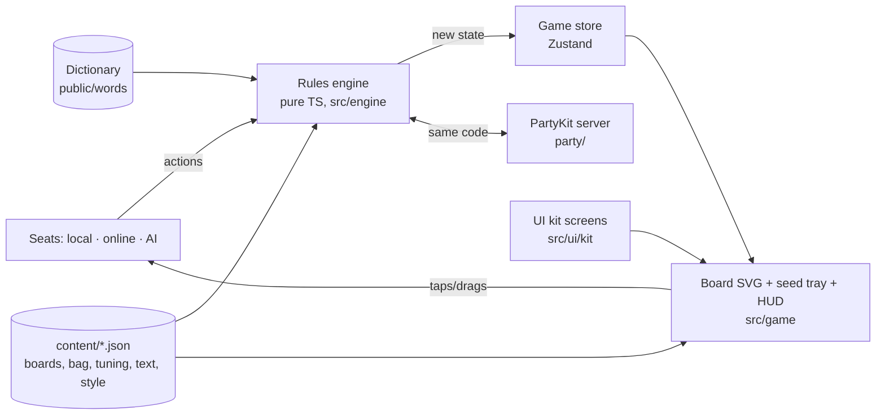

# Glyphtender — Technical Design Document (TDD)

> How the game is built. Plain English first; code names in `backticks` only where they help.
> Living document — /define writes it, /develop keeps it true, /tdd shows it.
> Last updated: 2026-09-30 (sprint 06 — feel pass: word indicators, score pops, drop target, turn pulse, "no" shake, layout)

## 1. At a glance
- **Platforms:** web — phone browsers (portrait + landscape) and desktop. Installable PWA.
- **Stack:** Vite + TypeScript + React, **2D SVG board (no Three.js)**, Zustand for screen state. Why: a flat hex board wants crisp, resizable, tappable shapes — SVG gives that for free, runs cool on phones, and every hex is a real element we can highlight and test.
- **Where it runs online:** GitHub Pages (game) + **Muzzy's own Cloudflare account** (online rooms): Cloudflare Workers + Durable Objects through **PartyServer** (PartyKit's open-source successor) — live at `glyphtender.joebrogno.workers.dev` (F23, D46). `party/worker.ts` is the front door, `party/server.ts` the room; config `wrangler.json`. Local: `npm run party:dev` (`wrangler dev` on **port 1997**; Roll Better uses 1999) + `npm run dev`. Deploy: `npm run party:deploy` (Muzzy's call — it's public). Client: `partysocket` (reconnecting WebSocket), unchanged.
- **Framework modules:** Game UI kit 0.2.5 (Cozy, night colours; 0.2.5 = Button `size`) · Dev Kit · **rooms** 0.1.0 (online, `src/rooms/`; harvested from Roll Better during this game) · **ai** (beta, framework v0.5 — D69: the brain from the original's goal-selection model; Glyphtender's instincts in `src/ai/`, design `.planning/design/ai.md`). · **audio** 0.1.0 (`src/audio/`, sprint 19 — the engine at start in `src/game/sound.ts`; UI kit 0.4.2 `setControlSound` plays the kit buttons' ui.tap / ui.back / ui.toggle)
- **Dev Kit tools used:** Console, Tuning, Color, **Snapshots** + **Bug capture** (kit 0.3.0, framework-first — F16/F17): the game plugs in through `src/devkit-game/glyphtenderAdapter.ts` (state = engine GameState + tray order; events = a line per placement/turn/refresh/phase/tangle/note); snapshots live in `content/snapshots/`, captures in `.planning/bugs/`. **Screens** (kit 0.4.0, F27, D49 — dev only): previews of gated screens (handoff, Magic reveal + end table 2/3/4p + tie, Pause, Rules, New game, online lobby host/guest 4 seats, couldn't join, bot took a seat / away, reconnecting, word list didn't load) in a sandbox frame over the game; list + sample data in `src/devkit-game/previews.tsx` + `sampleGames.ts` (seeded sim games); proved by `npm run e2e:previews`. **Search + sections** (kit 0.5.0): a search box under the tabs filters Tuning + Color live (substring anywhere in a word, camelCase split, all words must match; key, label, help, section, file); settings sit in collapsible sections — every tuning key has a plain-English `_labels` entry and a `_sections` home (20 sections, order in `content/devkit.json` sectionOrder); `#rrggbb` tuning values get a colour picker; proved by `npm run e2e:devkit-search`. **AI** (kit 0.6.1, framework F23 / F41): the framework's generic AI tab, plugged in from `src/devkit-game/aiDevKit.ts` (`aiTab(glyphtenderAi)` in tabs.ts) — personality picker + Copy to new (copies the bio, fills en.json `ai.personality.<id>.name` = "the <Id>"), two-handled trait ranges, goal order (drag / ▲▼), nudge / focus / chattiness / extras, steady goals (a 0–1 row per goal, empty = not set), mood shifts, bio (en.json ai.personality.<id>.bio), skill numbers, and the game's AI settings files `content/ai/goals.json` (bigAt per goal) + `pace.json` as Tuning rows (`settings` in the plug); problems from the kit's `personalityProblems` hold Save back; Save writes content/ai/*.json whole (notes kept) and the Save endpoint keeps each file's hand-written layout (`vite-plugins/devkit/formatJson.ts`: a no-change save leaves `git diff` empty). **▶ Watch** (`aiWatch.ts` startWatch): an all-AI local game on the real board (startGame bots = every seat, played through botPlays at pace.json's think times) with each decision's note and per-bot belief bars (evidence.ts beliefsOf); **Run check** (`aiCheck.ts` → `aiCheck.worker.ts` → `aiCheckRun.ts`): 6 / 20 / 60 arena games in a Web Worker (20+ adds a small skill ladder) → reportHtml in a new tab. Both use the tab's unsaved values. Proved by `npm run e2e:devkit-ai`. Later: Multiplayer (online milestone).

## 2. How it fits together

- **Rules engine** (`src/engine/`) — the whole game as pure functions: `applyAction(state, action, words) → state` (the word list is passed in — too big to live in the state) plus `checkAction` (why an action is illegal, or null), `legalDraftHexes`, `legalMoves`, `legalCasts`, `previewTurn` (words + Magic for the Cast button), `findWords`, `tangledIds`. No React, no screen, no network. Seeded random (bag order, refresh put-backs; the generator's position lives in the state) so a game can be replayed from its seed + action list.
- **Seats** (`src/store/seats.ts`, sprint 04) — who is in each chair: `{ kind: 'local' | 'online' | 'ai', name, colour }`. A local seat sends actions from taps; an online seat will receive them from the server; an AI seat (beta) will compute them. The engine doesn't know which. The store asks one question before any tap does anything — `canPlay()`: a game, no seed in the air, no handoff waiting, and the current seat is a **local human on this device**. Online/AI seats plug in there. `needsHandoff(seats, from, to, hideSeeds)` = two different local humans and seeds hidden. **AI seats (F42):** a local bot seat carries `ai: { personality, skill }` (startGame `bots` + `ai`; New Game resolves "Surprise me" at Start — newGame.ts). `store/localBot.ts driveLocalBots()` (run by GameScreen) starts thinking in a quiet moment, through ONE thinker per game (`src/ai/thinker.ts`: a Web Worker `think.worker.ts` that fetches the word list itself and answers with `seatBrain.ts`; inlineThinker where there are no workers), waits `waitLeft(thinkDelay(pace.json, kind, AI speed), spent)`, then `botPlays(action, show)` — the same rules door; a turn sets the plan (glide) then `flying` (the Board's landing calls finishCast). Each seat's rng = botSeed(game seed, seat), moved on only by actions it plays (repeatable). A new game / leaving / the game moving on drops the answer; stop() closes the worker. Dev Kit hooks: `onAiDecision`, `setAiSpeedOverride`. greedyBot is the never-freeze fallback (here and on the server); playLocalBot stays for tests.
- **Game store** (`src/store/gameStore.ts`, Zustand; plain helpers in `turnPlan.ts`) — the engine's state, the word list (fetched once), the planned move + cast and what's held (undo = drop the plan), refresh set-aside, each seat's tray order, and `flying` (input locked while a seed is in the air). Its actions only change the game by sending an engine action (checkAction first). Sprint 04 added: `seats`, `options` (the table options — Play again reuses them), `handoff` (`{ seat, afterGrow }` while the device is being passed on — the tray is hidden and every tap is ignored until `showSeeds`), `stats` (end table: best turn, longest word, words made — `stats.ts`, gathered from each turn's `lastTurn`), `revealAt` (how far the Magic reveal has got) + `skipReveal`.
- **View** (`src/game/`, built in sprint 03) — `GameScreen` (layout shell), `Board` (SVG hexes, pieces, highlights, word outlines, grown glow), `useThrow` (the Cast story), `SeedTray` (SVG), `trayLayout` (real-size maths), `TurnBar`, `ActionBar`, `GameOver`, `usePieceInput` (tap-tap and drag share one Pointer Events hook, on the whole screen), `prompt`, `usePreview`, `useTuning`, `art`, `devHook` (dev only). Sprint 04: `Handoff` ("Pass to Blue"), `DangerCue` (thorny ring / vine), `Reveal` (the players' Magic chips in the tray's place + the reveal clock), `RevealMarks` (tangled glow + each "+3" popping on its piece and flying into its owner's chip — a fixed layer inside `.game`), `GameOver` (the end table). Menus: `src/ui/NewGameScreen.tsx` + `newGame.ts` (choices remembered in localStorage), `menus.tsx` (Pause → Rules). Sprint 06 (feel pass): `WordBorders` (white word border behind the seeds), `ScorePops` (each seed's Magic → the turn's total over the caster), `PromptLine` (the prompt, just above the tray — `TurnBar` is now portrait + Menu), `dropTarget` ("drop here" while dragging), `useTurnPulse`, `useNopeShake`, `feel` (juice tiers from feel.json), `boardPlace` (the board sits close to the tray); plain logic in `src/store/wordMarks.ts` (pops + border hexes), `turnPulse.ts`, `nope.ts`; `src/ui/gameSettings.ts` (the game's own Settings rows — Tray position; exports `settings` = settings.json with the device's Full screen default — use it, not the file). `src/ui/fullscreen.ts` (D58): Settings → Display → Full screen (default on for touch, off for computers); on touch every tap (pointerup, capture) goes full screen while it's on; computers only from the main menu button / toggle, and Esc turns the setting off; iPhone (no Fullscreen API) shows an info row "Share → Add to Home Screen" instead; installed (display-mode standalone) hides both; proved by `npm run e2e:fullscreen` (port 5243) + fullscreen.test.ts.
- **Layout shell** (`src/game/GameScreen.tsx` + `game.css`) — chooses **stacked** (tall) or **side tray** (wide) from the *shape of the free space* (aspect ≥ 1.15 → stacked), not the device. Board SVG auto-fits its box; zoom (optional, with a Fit button) not built yet. Side layout: the right column is the tray's width (sidePanelShare × width). Sizes in `content/tuning/layout.json`.
- **Menus/HUD** — UI kit screens only (MainMenu, Settings, Pause, HowToPlay = Rules, the new-game screen and end table built from kit Screen/Panel/ListRow/Stepper/Selector/Toggle, PlayerChip for the reveal, toasts). Board, tray and pieces are game components styled only with kit tokens.
- **Sound** (`src/game/sound.ts` + the framework audio module in `src/audio/`, sprint 19, F55) — code says WHAT happened (`playSound('seed.land')`) at the moment the player SEES it: in the code that plays the animation (useThrow landing, useGlide end, ScorePops' scheduled times, DangerCue appearing, SeedTray refresh stages, useTurnPulse, Handoff, Reveal steps, EndHighlights, OnlineSession), taps in the store actions; `content/audio.json` says what it sounds like. People, bots and online replays share those paths, so they sound the same; a jump (load / rejoin, `happened` = null) is silent (catch-up). A juiced moment whose sound has no files plays its feel tier's sound (`feel.ts juiceSound`). Settings → Audio → `applyAudioSettings` (gameSettings.ts). Dev/Playwright: `window.__audioLog` (e2e:audio).
- **Online** (`party/`, sprint 05) — `server.ts` is the rooms module's `RoomServer` with Glyphtender's plug-in `glyphtenderRules.ts`; it runs the *same engine*; the server is the only one who knows the bag, the rng and every hand (`serverGame.ts`); each player is sent **their own view** (`views.ts`: own seeds, others' as '?', no Magic until the end). On the device: `src/store/onlinePlay.ts` (views in, replays, my actions out) and `src/ui/online/` (session, join/create, lobby, the live connection).

**Golden rules**
- The engine never touches the screen or network; the screen never changes game state except by sending an action.
- One engine for client, server, AI and tests — rules are never re-written anywhere else.
- Hidden information stays hidden in the data, not just the display: online views never contain other hands or Magic totals.
- Every tweakable value lives in `content/` — board shapes, bag, hand size, bonuses, timings, layout sizes, colours.
- Every fixed bug gets a test that guards it; every rule in GDD §4 has at least one test.

## 2b. Game-specific systems
**Coordinates** — engine uses **axial hex coordinates** (q, r) — the standard (Red Blob Games) — so leylines are simple steps. Boards are defined in `content/data/boards.json` as column heights (`[4,7,8,9,10,9,10,9,8,7,4]`) like Muzzy's paper notation, converted at load. Designer notation `C4-3` shown in Dev Kit / bug reports.
**Rules engine files** (`src/engine/`, built in sprint 02) — `types.ts` (GameState is plain JSON-able data: phase draft/play/refresh/over, current seat, snake order, glyphlings `{id, seat, hex}` with id = seat×2+0/1, seeds by hexKey, hands, bag (draw from the front), Magic, tangled ids, lastTurn, tangle bonus, winners, rng) · `setup.ts` (bag + snake order) · `draft.ts` · `moves.ts` · `turn.ts` (move + cast + Magic + draw) · `refresh.ts` · `wordFinder.ts` · `words.ts` (list loader) · `tangle.ts` (tangles, end, bonus, winners) · `engine.ts` (`applyAction`) · `rules.ts` (THE one door since F30/D61: the framework Table contract — setup, legalActions, check, apply → state + events, fast mode, viewFor; every caller goes through it) · `sim.ts` (random/greedy players + invariants; `npm run sim`) · `testkit.ts` (hand-made positions by designer label). Actions: `{type:'draft', hex}` · `{type:'turn', glyphling, to, seed: hand index | null, target}` · `{type:'refresh', setAside: hand indexes}`. Illegal actions **throw** an Error with a plain-English reason. Rule numbers are copied from `content/tuning/rules.json` into `state.config.rules` at new game, so replays and online games keep the numbers they started with.
**Words** — per leyline, collect the run of letters through the new seed; check every sub-run of ≥ min length containing the new seed; keep valid words; drop any word covered by the union of the other kept words on that line (GARDENING/DEN, SEAL+LEAP/ALE). Tested against every example in the digest.
**Piece states + the throw** (from the F01 prototype) — every piece shows one of: options (the current player's colour — move = filled hex + dot, cast = dashed ring + hollow dot; D51) · held (solid ring, player colour) · planned (pulsing halo at the hex edge, player colour; targeted seed faded) · done. The halo sits *outside* the art's own coloured frame. Cast plays: glyphling hop → seed flies a bezier arc (time = `flightBase` + `flightPerHex` × distance) → runeblossom sprouts with overshoot; the game state commits on landing; input is locked in flight. Frames mutate SVG attributes directly (no React state per frame): the flight is a requestAnimationFrame loop on a ref, the hop / sprout / grown-word glow use the Web Animations API, the planned halo pulses with an SVG `<animate>`. After landing the words that grew score one at a time and fade (the score sequence, D52). Reduce motion → no flight, the turn commits at once. **Move glide** (F15, `glide.ts` + `useGlide.ts`): whenever a glyphling is drawn on a different hex than last render it slides there (Web Animations on its `[data-glide]` group, ease-in-out + a tiny `moveSettle` bounce; time = `moveBase` + `movePerHex` × hexes) — it only knows "was on A, now on B", so a planned move, Undo / the ghost, the dev hook and (online) other players' committed moves all glide the same way; a new change mid-glide starts from where it is on screen; it never locks input; reduce motion = instant. Numbers: `content/tuning/anim.json`, colours: `garden.json`.
**Feel pass** (sprint 06, GDD §4 "Muzzy's feel notes") —
- **Word indicators** (a table option: new-game screen, remembered; online the host's lobby option, sent in every view's `options`). On: planned words (while aiming) and grown words (after landing) share ONE look — a white ring (`wordBorder`, `wordBorderWidth`) centred on each word hex's edge and drawn UNDER the seed art, so it frames the letters like a border; the grown words light only while they score (D52), then fade. While aiming at 2+ words → the **word spotlight** (F25, D50): one word lit at a time, looping (`spotlightHold`, `spotlightFade`), with an optional "QUA +4" label (`spotlightLabel`) — `WordBorders.tsx`, `useWordSpotlight.ts`, `spotlight.ts`. Off: no border, "Cast" without "+N", no score pops.
- **Score pops → the score sequence** (D52; `wordMarks.scorePops` + `scoreSequence`, keyframes `game/scoreFrames.ts`, all tested): per word, per seed, the engine's `seedMagic` (1 + ownershipBonus for the caster's own seed — `magicFor` adds exactly these up). After the landing the words score ONE AT A TIME in `lastTurn.words` order (= the aiming spotlight's order): outline + bubble (just the word) → its seeds pop → fly one by one into the running total over the casting glyphling (`lastTurn.to`), which ticks up and grows per point (`scoreTotalGrow`, cap `scoreTotalMaxGrow`) → next word → final hold → everything fades. Every part is ONE Web Animation over the whole sequence, started together (ScorePops.tsx), ending at opacity 0 (B007). The store's `scoring` (startScoring / endScoring, its own timer = `landingSeconds` + 0.12 s) blocks input and holds the handoff box, the reveal and online's view queue. Computed on the device from the board (words + seed owners are public; online views still zero every Magic). Reduce motion: no flying/bounce, same steps. Never smaller than `scorePopMinPx` on screen.
- **Cast range** shows as soon as the move is planned (dashed rings, before a seed is picked); an aimed seed re-aims by tapping another ringed hex.
- **Turn trails** (D51; src/store/trail.ts → game/TurnTrail.tsx) — one trail on the board at a time: plan (my move's dotted path + the cast arc = the throw's own curve) · live (online, another seat's replay: `trail` in the store, drawn on over trailLead, held trailHold, THEN the glide) · faint (game.lastTurn, until a pick-up / plan / refresh / reveal / the next replay). Drawn under seeds and glyphlings.
- **Drop target**: while dragging, the legal hex under the floating piece fills bright + a glow ring spills past it (the piece covers the hex); an illegal hex shows nothing (`turnPlan.dropKind`).
- **Turn pulse** (`turnPulse.pulsingGlyphlings`): the current local human's glyphlings that can move breathe (feel.json small tier, `turnPulseTime`) until a move is planned; never in the draft or a refresh, never the held or a tangled one; online only on your turn.
- **"No" shake** (`nope.nopeFor`): another player's glyphling, a tangled one, any glyphling outside your move step, a planted seed, a tray seed tapped or dragged before moving (no reorder before the move — Muzzy, B008), anything of yours when it isn't your turn online → a quick sideways shake of that piece (feel.json small tier × its width, `noShakeTime`). Quiet: seed in the air, handoff, waiting for the server, game over, empty hexes.
- **Layout**: action buttons are a board hex tall (hex width × √3/2, ≥ 44; kit Button `size`); the prompt sits just above the tray (heading size; title size when hexes ≥ 64 px); the board sits close to the tray (`boardPlace.boardShift`: tall = right on it; wide = 1/8 of the spare room on the tray's side). Settings → Gameplay → **Tray position** Standard / Flipped (tall: tray above; wide: tray left), followed live; the side column keeps the ruler's width either way.
- Every one of these animates with Web Animations on SVG elements (no React state per frame) and reads timings/sizes from content/.

**Tray** — seeds are **real size: tray seed = the board's on-screen hex width, never below `trayTileMin` (44 px)**; one row of 8 if that fits, else 2 rows of 4 rather than shrinking; only if 4 still don't fit do they shrink to fit (never below 44). Maths in `src/game/trayLayout.ts` (tested). Measured (Small board, e2e): phone tall hex 42 → seed 44 (2×4) · phone wide 41 → 44 (2×4) · desktop 96 → 96 (2×4). Tray order is the screen's own (store), kept across turns; reorder by dragging within the tray; Shuffle.
**Pass-and-play** (sprint 04) — the store decides when the device is passed: after the draft (before turn 1) and whenever play passes to another local human, **after** any refresh (the player who just played refreshes first). `Handoff.tsx` shows a kit Screen dialog (the garden dimmed but visible) with the next player's portrait, "Pass to Blue" and a "Show my seeds" button in their colour; it waits for the throw's sprout, word border and score pops (`landingSeconds`) so everyone watches the move. It is NOT on the kit screen stack, so Esc / phone Back can't reveal the seeds by accident. Hide seeds off → never shown.
**Tangle danger** (`src/store/danger.ts`) — from the committed board with the engine's `legalMoves`: 1 move = warning (dashed "thorny" ring, owner's colour), 0 = tangled (a curly vine + leaves, the glyphling fades). Everyone's glyphlings; never during the draft; a held/planned glyphling shows its own ring instead.
**The Magic reveal** (`src/store/revealPlan.ts`, pure + tested) — a list of steps from the finished game: tangles pulse → one count step per player, their WORD Magic (total − tangle bonus), lowest first → one bonus step per rival piece next to a tangled glyphling ("+3", same sum as the engine's tangle bonus): it pops on the piece and flies into its owner's chip total, which pops as it lands — the score sequence's motion (D56) → winner. `revealView(steps, at, game).scores` = each chip's total on screen (a bonus counts once its step is over); a bonus step lasts at least revealPopTime + scoreFlyTime. Nothing stays on the board afterwards. Each card is fixed-size from the start (`.game-reveal-sizer`, a hidden copy at its biggest — e2e selectors skip it). Every "points fly into a total" uses `scoreFrames.flightFrames` (the seed's arc, anim.json arcHeight). `revealAt` walks through them on timers (anim.json); Skip jumps to the end; reduce motion starts at the end; the end table opens when it finishes. Magic stays "?" on every chip until that player's count.
**The game log + end screen** (F26, D48) — the engine logs every turn in `GameState.log` (src/engine/log.ts): round, turn no., seat, move, seed, each word's letters + seed owners + Magic + own Magic, seeds refreshed, everyone's totals after, tangled / newly tangled / freed, and for each newly tangled glyphling who COMPLETED it (`completeTangles: { glyphling, by | null }[]`, log.ts completeTangler — only one rival's seeds next to it, board edge ignored; missing in older logs → the scorecard shows "–"); at the end who ended it, a self-tangle and each tangle's bonus per seat. `src/game/stats.ts` (pure, tested) turns it into standings (shared places), a scorecard per player, skill awards (D54: 14, earned only, from the log's per-turn facts — `mobility` before / after the move / after the cast, `castOver`, `blocked` spot; Walled garden rebuilds each turn's gardens from the log + the final board — stats.ts walledCells (via `pendingLog`, hidden online), words' `hexes` + `at`; thresholds in endscreen.json, provisional) and the Story chart (Magic per round + a Tangles step; knot / lead-change marks, ≤ maxMarkers, + a 4-pointed star per award; a drag-to-scrub line + one fixed-size moment slot under the key). The screen (GameOver.tsx → EndResults / EndHighlights (kit Carousel) / StoryChart / EndScorecard) is three tabbed, swipeable pages with Menu · New game pinned; its words are in en.json → game.gameOver (endText.ts fills them). The chart is game graphics like the board (an SVG in real pixels, colours from garden.json + style names). Finished games for 2p/3p/4p/a shared win: e2e/fixtures/end-*.json (`npm run fixtures:end`) — not content/snapshots/, which the Dev Kit bundles into live builds; `npm run e2e:end` shoots every page at 3 sizes. Kit gap logged: kit Tabs wrap 3 tabs onto 2 lines at 390 px — game.css lets them share one line for now (the 2 check:ui warnings).
**Dictionary — the official Glyphtender word list** is the original's `words.txt`, **copied byte-for-byte** (blob `3280512a`, identical on the original's main and festive-booth): 63,657 words (63,656 line breaks — the last word, ROMAN, has none after it; Zipf ≥5/4/3/2 = 1,000 / 6,342 / 21,805 / 43,997), 2–15 letters, each with a **Zipf score** (how common it is: THE 7.73 … rare words 0). How it was made: Muzzy chose TWL in the Python prototype (2025-12-14) → 63,612-word list (2025-12-17) → cleaned: abbreviations out, scoring fixes (12-21) → +218 missing words incl. 2-letter words (12-22) → roman numerals out + Zipf column added for AI difficulty (12-23). **Never edit it by hand in code** — it lives in `public/words/words.csv` (marked binary in `.gitattributes`; a test checks its SHA-256); changes are deliberate, logged commits. The game uses the words; the **AI uses the Zipf scores** (difficulty + personality vocabulary). Loaded once, async, into a `Map<word, zipf>`; ~250 KB gzipped.
**AI (beta)** (F38/F39, D69–D76; design `.planning/design/ai.md`) — the framework brain (`src/ai/kit/`, never edited here) + Glyphtender's instincts in `src/ai/`: `plug.ts` (the GamePlug: 7 goals, readings, imagine, candidates — legalActions thinned to the skill's count, every rival-tangling move (≤ half) and own-glyphling rescue (≤ a quarter) kept, the rest sampled — key, describe in designer notation, special) · `readings.ts` (handQuality, myDanger, rivalDanger, fill, territory, endNear, behind, ahead — 0–10, the names the personalities' mood shifts use) · `evidence.ts` (each seat's Magic as seen on the board + per-turn histories → kit `beliefs.ts`; rebuilt from the view every decision, no memory) · `imagine.ts` (rivals' '?' seeds + the bag dealt from the unseen letters) · `goals/` (TRAP, SCORE, DENY, ESCAPE, BUILD, STEAL, DUMP — `{ value, why }`, weights at the top of each file) · `decisions.ts` (draft, refresh, call it) · `look.ts` (shared board facts: a turn's outcome, mobility, territory on numbered cells, letters' junkiness — remembered per board so imagined worlds share the work). Data flow per decision: `viewFor(game, seat)` → readings → mood shifts + trait roll (brain) → imagined worlds → special? (draft / refresh / call it) → goal roll → candidates → every goal scores every candidate (main × 1 + nudge × the rest) → pick within spread / top N → a note. `src/engine/bot.ts` `aiBot(personality, skill, words, onDecision?)` is the Table Bot; Online the server plays it too (F43, D79). Personalities + skills are data (`content/ai/`). Speed (Node, mid-game): First Class avg 22 / worst 33 ms, Archmage avg 55 / worst 81 ms (phone ≈ ×4).
**Multiplayer** (alpha, built in sprint 05) — server-authoritative, same engine. Design: [design/online.md](design/online.md). How it was built:
- **Room** = the rooms module (`src/rooms/`, framework 0.1.0): codes, join/rejoin by persistentId, host + migration, ready/start, a bot takes a dropped/left/idle seat, empty-room clean-up; its own messages (`join`, `ready`, `start`, `leave`, `back_to_lobby`, `action` → `room`, `view`, `error`, `closed`).
- **Glyphtender's messages** ride inside it (`party/protocol.ts`): player → `{ kind: 'play', action, version }` or `{ kind: 'sync' }`; server → a `GameView` `{ gameId, version, mySeat, names, change, by, game, turnEndsAt, results }`. `game` is GameState-shaped (the store, board, previews and danger cues work unchanged): other hands and the bag are '?' × count, rng + seed 0, every Magic zeroed until `phase: 'over'`; then `game` is the whole truth and `results.stats` the end table (gathered on the server).
- **Server checks** (`glyphtenderRules.ts`): shape (the rooms checks helpers) → a seat in this game → its turn → `version` = the server's → the engine's `checkAction` → `applyAction`. Every refusal is a plain-English Error; the state is unchanged.
- **The server's own turns** (`turnClock.ts`, F43 / D79): the real AI plays them — `aiAction` asks `seatBrain.ts` (the same thinking as the phone's worker) with ONLY `viewFor(game, seat)`, checks the answer with the rules, and falls back to the greedy bot ("keep all" on a refresh) if the AI fails, logged. A bot seat plays one action per paced step (`pace.json` Normal: draft · move + cast · refresh — the refresh is its own step); a timed-out or idle person's seat goes to the bot until they tap (D83). Which AI: a host-added seat's room `profile` ("Scholar/Archmage", `party/aiSeats.ts`), else `defaultAi` (Survivor at First Class). The pauses come from their own secret number (`ServerGame.paceRng`, never sent). The host adds AI seats in the lobby: rooms `add_bot` carries the profile, `botProfile` checks it and names the seat after the personality ("The Survivor", "The Survivor 2"). Tests: server.test (the AI seat's requests = exactly its view, never the log; lobby profiles; pace; fallback) · `npm run e2e:online-ai`.
- **Word list on the server**: bundled as text. esbuild has no .csv loader, so `scripts/server-words.mjs` copies `public/words/words.csv` → `party/words.gen.txt` (gitignored) before every build (`wrangler.json` → `build.command`; `rules` reads .txt as Text). Server bundle **915 KB minified / 293 KB gzipped** (Workers free limit: 3 MB gzipped).
- **Device**: my seat plans exactly as pass-and-play; Cast posts at once and the throw flies; the view is applied when the seed lands (if it's late, it asks again every 3 s). Other seats' turns replay on the old view (glide → throw after `glideSeconds` → land → new view + sprout), queued in order. No handoff online. A reload goes straight back to the seat (room code in sessionStorage). Party host = `VITE_PARTY_HOST`, else the page's host + wrangler.json's dev port.
- **Screens**: main menu → Play online → name + Create / Join (kit Lobby) → lobby (kit Lobby + the host's options: Garden Auto/Small/Large, 2-letter words, Turn timer, Word indicators) → the game → end table (New game = the host takes everyone to the lobby, where the host starts again; a guest's New game says "Waiting for the host…" · Menu = leave). Sprint 06 removed Play again. Connection lost → the kit's Reconnecting box.
- **Tests**: `party/server.test.ts` (fake PartyKit + the real rooms module: whole games with every view checked for secrets; refusals; timer + bots) · `src/store/onlinePlay.test.ts` (the store against a fake room, incl. a whole game) · `npm run e2e:online` (two browsers + its own wrangler dev on 1995 + Vite on 5311; every received WebSocket frame checked for secrets; reload, host drop, rejoin, reveal + end table on both).
**Timers**
| Timer | Length | Owned by | Starts when | On expiry |
|---|---|---|---|---|
| Handoff screen | none (tap to reveal); appears after growTime + wordGlowTime when a seed was thrown — or, if it scored, once its score sequence has faded (store.scoring, D52) | client | turn passes to another local seat (and before turn 1) | — |
| Grow animation | ~0.8 s (`content/tuning/anim.json`) | client | Cast committed | next turn shown |
| Reveal steps | tangles 1.4 s · each +3 0.55 s · each count 1.5 s · winner 2.5 s (≈ 8 s for 2 players), skippable | client | game ends, after the last seed grows | next step; after the last → end table |
| Turn timer (online) | off by default; the host picks 30 / 60 / 90 / 120 s (`content/rooms.json` → turnTimerChoices) | server | a seat's turn starts (its refresh is the same turn) | a bot takes the seat at once (room.timedOut, D83) and plays on at the AI's pace; a tap takes it back |
| Idle → bot (online) | warning at 30 s (`idleWarnAfterMs`), bot at 60 s (`idleTakeoverAfterMs`) — rooms.json | server (rooms module, D83) | the game waits for that seat (room.onTheClock); any tap/key ("active") or move restarts it | 30 s: a draining bar on their screen only · 60 s: a bot plays their seat mid-turn (the AI, Survivor at First Class); any tap takes it back |
| Dropped → bot (online) | 60 s (`botTakesOverAfterMs`) | server (rooms module) | a player's connection drops mid-game | a bot takes the seat; rejoining takes it back |
| Bot turn (online) | the AI's Normal-speed pause per action (`content/ai/pace.json` thinkSeconds: draft 0.6–1.2 s · move + cast 0.8–1.6 s · refresh 0.5–1.0 s) | server | it's a bot seat's turn (its refresh is a step of its own) | the AI thinks (in the room) and plays one action, so the others can watch it |
| Waiting for my view (online) | 3 s, repeating | client | my action is sent | ask for the view again (`sync`); a same-version answer = the action was lost → the plan comes back |
| Empty room (online) | 5 min (`keepEmptyRoomMs`) | server (rooms module) | the last player drops mid-game | the room is cleared (an empty lobby clears at once) |
| Rematch (online) | none | — | results shown | the host's New game → everyone to the lobby (sprint 06: no Play again) |
| Score sequence (D52) | scorePopDelay 0.25 + per word max(scoreWordTime 0.9, its pops + fly + pop settle + spotlightFade ≈ 1 s for 2 letters) + scoreTotalHold 0.8 + scoreTotalFade 0.4 → 1 word ≈ 2.4 s, 3 words ≈ 4.3 s; no skip | client (store.scoring + its timer) | a seed that grew words lands (mine, pass-and-play, or another player's replay online) | everything faded; THEN input, the handoff box, the reveal and online's next view go on |
| Turn pulse | loops, turnPulseTime 1.6 s | client | the local player's turn (play phase) | stops when a move is planned |
| "No" shake | noShakeTime 0.35 s | client | a refused tap | — |

## 3. Data the game reads (editable by Muzzy — in Obsidian or the Dev Kit)
| File | What's in it | Edited with |
|---|---|---|
| `content/data/boards.json` | board shapes (column heights), default board per player count | Obsidian |
| `content/data/bag.json` | seed counts per letter (a plain `Q` since D47) | Obsidian / Dev Kit → Tuning |
| `content/tuning/endscreen.json` | end screen: which awards may show and their carousel order (awardOrder, 0 = off), carouselSeconds 4 / carouselPauseSeconds 4, place ribbons ribbon1–4 + ribbonSize, the award thresholds — PROVISIONAL (D54; lockdown ≥ 6 / ≤ 1 left, pincer: a hunt over your turns took ≥ 75% of a ≥ 8-move glyphling's room (D68), weed toss ≥ 14 blocked or ≥ 10 cut, walled garden ≥ 30 Magic in ≤ 10 hexes, hedge ≥ 3 seeds, power play ≥ 4 words, long word ≥ 6, hijack from ≥ 3 letters, bridge ≥ 2 each side, comeback = the biggest (no minimum), trickster / called it ≥ 10, close call ≥ 4), the chart's marker cap, draw-in time, line width, height | Dev Kit → Tuning |
| `content/tuning/rules.json` | hand size 8, min word 2, tangle bonus 3, tangles to end 2, ownership bonus 1, random turn order on (randomTurnOrder 1; 0 = Yellow, Blue, Purple, Pink — read at New Game / room start, D82) | Dev Kit → Tuning |
| `content/tuning/layout.json` | stacked/side threshold, tray seed minimum (44) + gap, side panel share, board margin, drag lift + drag start distance | Dev Kit → Tuning |
| `content/tuning/anim.json` | move glide (moveBase, movePerHex, moveSettle), turn trails (trailLead 0.5, trailHold 0.35), throw (flight, arc, hop), sprout, halo pulse (pulseTime — planned pieces only), handoff/reveal wait after a landing (wordGlowTime 1.4); word spotlight (spotlightHold 0.8, spotlightFade 0.12); reveal timings (revealTangles, tangleBlinkTime — split from pulseTime 2026-10-03, revealBonus, revealCount, revealWinner, revealPopTime); sprint 06: score sequence (scorePopDelay, scoreWordTime, scorePopGap, scorePopTime, scorePopHold, scoreFlyTime, scoreTotalHold, scoreTotalFade, scoreTotalGrow, scoreTotalMaxGrow — D52), turnPulseTime, noShakeTime | Dev Kit → Tuning |
| `content/tuning/garden.json` | night garden colours (board box background, hexes), 4 player colours (also the move/cast options and turn trails: glowStrength, castRing, castFill, trailWidth, trailStrength, trailFaint) + dropStrength ("drop here"), word border (wordBorder white, wordBorderWidth; grownGlowStrength = the grown words' strength; spotlight label: spotlightLabel on, spotlightLabelSize, spotlightLabelMinPx), ghost + faded-seed strength, flying-seed shine; danger cues (warningWidth, warningDash, vine, vineWidth, tangledDim); reveal "+3" (revealPop, revealPopSize); score pops (scorePop, scorePopSize, scoreTotalSize, scorePopMinPx) | Dev Kit → Tuning |
| `content/tuning/feel.json` | game-feel juice tiers small / medium / big (grow = swell past full size, shake = sideways share of a piece's width) and which moment uses which (turnPulse, noShake = small · seedPop = medium · totalPop = big); `sounds`: a word of chordLetters (5)+ letters plays word.chord, a cast of flourishWords (2)+ words plays cast.flourish | Dev Kit → Tuning |
| `content/audio.json` | every sound (35 + 3 feel-tier sounds): files (in `public/audio/{sfx,ui,stg,amb,mus}/`), volume group, dB, random pitch/volume, copies, cooldown, importance, ladder (score.pop, reveal.count — D major pentatonic, 8 steps), duck (flourish, tangle, winner), loops (amb.night, mus.menu; mus.garden plays once); buses, limiter, snapshots (paused, reveal), duck, limits. `_help` per sound says when it plays | Obsidian (Dev Kit Sound Board = F30) |
| `public/audio/` | the placeholder sounds (F56: 56 MP3s, credits in `content/credits.json`). Effects precached by the PWA; music + ambience cached on first play | organize-assets |
| `content/ui/style.json` | UI kit look: Cozy preset + night colour tweaks (D09) — every menu/HUD colour, shadow, panel texture | Dev Kit → Color |
| `content/ui/settings.json` | Settings screen rows (kit standard list; `"on": false` hides a row — language, account and placeholder links are off for now); the game's own: Gameplay → Tray position (Standard / Flipped); Audio = the kit's standard rows (Master 80 · Music 50 · Ambience 60 · Sound effects 80 · Menus & buttons 70 · Mute everything · Mute in background · Mono — the audio module reads the same ids) | Obsidian |
| `content/text/en.json` | every player-facing word — menu, new game (`newGame`), turn prompts, notes, buttons, pause, rules (3 pages), handoff, reveal, end table (`game` section) | Obsidian |
| `content/rooms.json` | online rooms: seats 2–4, missed turns before a bot (2), dropped player → bot after (60 s), empty room kept (5 min), bots allowed (no) · Glyphtender: turn timer choices (the first = the default: 0 = off, then 60, 90, 120 s), bot turn delay (1.5 s). The server bundles it: a change needs a server rebuild | Obsidian |
| `content/ai/personalities.json` | the 7 personalities: trait ranges, goal priority, nudge, mood shifts (reading → trait), chattiness, extras { nerve, vocabulary, extraWordBonus } (D70). Shape: `{ _help, _labels, _sections, personalities: Personality[] }` — notes keyed by the setting's path inside ONE personality | Dev Kit → AI (F23) / Obsidian |
| `content/ai/skills.json` | Apprentice / First Class / Archmage: candidates, imagined worlds, pick spread + top N, wobble, belief noise, extras.zipf. Shape: `{ …notes, skills: Skill[] }` | Dev Kit → AI (F23) / Obsidian |
| `content/ai/feel-targets.json` | each personality's feel targets (D72): `personalities.<Id>` = [{ meter (src/ai/meters.ts), op `>=` `<=` `tableBest` `tableWorst` `nearAverage` `neverExtreme`, value?, label }] + `all` = [{ check, min?, max?, label }] | Dev Kit → AI / Obsidian |
| `content/ai/pace.json` | think times per action kind (draft, moveCast, refresh: min/max s), speeds (slow 0.5 · normal 1 · fast 2 · instant 0 = no wait), timeBudgetMs. Tuning-tab format (_labels/_sections/_ranges by path), edited in the AI tab's "AI: pace" section (plugged in as a settings file; Watch reads its think times) | Dev Kit → AI / Obsidian |
| `content/credits.json` | fonts, word list | organize-assets |

## 4. Standards
- **Folders:** `src/engine` (rules, pure + tests) · `src/store` (incl. seats) · `src/game` (board, tray, layout) · `src/screens` (kit screens wired up) · `src/ui/kit` (installed, never edited) · `src/devkit` (installed) · `src/devkit-game` (our tabs) · `party/` · `content/` · `public/art` · `sketches/` (prototypes — throwaway) · `e2e/`.
- **Naming:** game words in code match the GDD: `glyphling`, `seed`, `cast`, `magic`, `tangled`, `leyline`. Files `PascalCase.tsx` for components, `camelCase.ts` for logic; JSON keys camelCase.
- **Readable code:** plain names, small files (< ~300 lines), a one-line comment on anything non-obvious. No clever tricks.
- **Tests:** vitest for the engine (every rule, every original bug as a guard) and store; e2e (Playwright, bundled Chromium only) for a scripted full game at 390×844, 844×390, 1440×900. Feel is judged by Muzzy, not tests.
- **Safety net (F29, v0.6):** `npm run check:golden` (300 golden games replay move for move, ~6 s; a 24-game sample runs in `npm test`) and `npm run check:shots` (24 screens × 8 sizes vs `e2e/shots-before/`, ~3.5 min, port 5250, diffs in `e2e-shots/shots-diff/`) must both say SAME — each writes a results page Claude links for Muzzy (dev server: `/e2e-shots/report.html`, `/e2e-shots/golden.html`) after every rebuild slice. Re-record (`npm run golden:record` / `npm run shots:record`) only when a change is MEANT to play / look different (D60).
- **Same build everywhere:** CI runs `npm test` + `npm run build` (type check included) before deploying.
- **Branches:** one work branch per delivery (`dev/<milestone>`), merged by /deliver. Tiny fixes on main.
- **Prototypes** live in `sketches/`, reachable at `/glyphtender/sketches/<name>`; their code is not reused unless it's clean — the learnings go into the GDD/TDD.

## 5. Budgets
| | Target | How it's checked |
|---|---|---|
| Frame rate | 60 fps on a mid-range phone during grow animations | Dev Kit → Perf (when built) / DevTools |
| First load | < 3 s on 4G; download < 2 MB incl. dictionary + stand-in art | /deliver quick check |
| Art | runeblossoms + glyphlings ≤ 256 px WebP (originals are 2000 px) | organize-assets |
| Audio (beta) | sound effects ≤ ~500 KB, loaded after the first screen (not in first load); music streamed, cached on first play | /deliver quick check |
| AI turn (beta) | < 1 s on a phone, in a Web Worker | timing test |
| Network | 1 action + N views per turn; PartyKit free tier | server logs |

## 6. Security & fairness
- Online: clients only send *intentions*; the server's engine decides. Clients never receive other hands, the bag order or Magic totals — so a cheater can't read them.
- Pass-and-play is on trust (it's one device).
- Dev Kit tools that affect play (Snapshots restore, bag editing) are offline-only: the adapter's `canRestore` is false in an online game and the dev hook's `playRest` / `playUntilDanger` do nothing (the server owns the game).
- Online input checks: the rooms module refuses junk and messages over 16 KB; Glyphtender's checks refuse wrong shapes, other seats, stale versions and illegal moves. Names are trimmed to 16 characters. The persistentId (which owns a seat) is never sent to other players.
- No secrets in the repo; `.env` gitignored.

## 7. Compliance & legal (general audience — not made for kids)
- [ ] Privacy policy page (`public/privacy.html`, as Roll Better)
- [ ] App store age rating questionnaire (if stores ever)
- [ ] Data safety / privacy labels (if stores ever)
- [x] Analytics/ads/accounts → consent (none planned) — alpha has none: nothing to consent to (checked 2026-09-30)
- [ ] **Word list licence settled** (see §9 — keep the Zipf pipeline either way) — before 1.0
- [x] Every font, sound, image licensed (UI kit fonts carry their own credits) — 7 kit fonts SIL OFL + Muzzy's own art, all in content/credits.json; no sounds yet (checked 2026-09-30). Word list tracked there as 🟡 until its licence is settled (line above)
- [ ] Accessibility basics: 18 px text floor, 44 px targets, glyphling colour never the only signal (shape marks in 1.0), reduced motion

## 8. Decisions log
```
D84 · 2026-10-09 · Audio: a framework module on plain Web Audio; code plays named sounds, content/audio.json says what they sound like
  Muzzy: "audio will be a module we're breaking out into bmuz… tweakable in the dev kit… you'll need to become the
  subject matter expert" · "solve the architecture and systems for sound… don't let perfect be the enemy of good".
  Proposed by: Claude   Options: Howler / Tone.js / own thin layer on Web Audio
  Chose: own layer (framework audio/, design: framework/.planning/design/audio.md) — Howler is stale (2023) with no
  buses or filters; Tone is a 75 KB music kit. A pure planner (variants, limits, ladder, stale drop) is unit-tested
  without audio; the engine is thin. MP3 everywhere (Opus on iPhone still flaky), files in public/audio/ so the Dev Kit
  Sound Board can drop them in without a rebuild. iPhone silent switch respected (Muzzy: "sure"). Sounds play at the
  animation's moment, not the event's. No code-made placeholder sounds (Roll Better's were "horrible") — free recorded
  libraries for beta (Muzzy: "free libraries… for now"). Direction B, the garden sings (design/audio.md).
D83 · 2026-10-08 · Idle takeover: a warning bar, then a bot mid-turn, and any tap gives it back (F52, framework rooms 0.4.0)
  Muzzy: "when a player is absent for 1 minute (no actions), a bot should take over until they are active again…
  a 30s depleting bar… this is a mid turn takeover, almost as if they had disconnected" · "if there's a timer, then
  it just makes sense to make a bot take over the turn after the timer runs out". Built in the framework first:
  the room owns the idle clock — the game only says whose move it waits for (room.onTheClock([seatId]) in
  turnClock.ts planNextTurn: draft placement, turn and its refresh; a seat that stays on keeps its clock). A
  connected human on the clock with no move and no "active" ping for idleWarnAfterMs (30 s) gets idle_warning (their
  screen only: the kit's IdleWarning, a bar draining to the takeover); at idleTakeoverAfterMs (60 s) the seat goes
  to the bot exactly like a drop-out (kind bot, still connected → the others' "is idle" toast + 🤖), and the
  existing bot path plays it at the AI's pace. The client pings on pointerdown/keydown while it's its turn, the bar
  is up, or the bot has its seat (useRoom.active(): ≤ 1 per 5 s, at once when urgent) → the clock restarts / the
  seat is theirs at once ("is back"). The turn timer running out = room.timedOut(seatId): the same takeover (was:
  the server played one whole turn at once + missedTurns; 2 in a row → bot). Removed: Seat.missedTurns,
  missedTurnsBeforeBot, turnClock autoPlay. Leave stays a deliberate bot (no connection, so no tap can take it back
  — only a rejoin); a dropped player has no idle clock (the 60 s away timer covers them) and still reclaims by
  reconnecting. Options weighed: keep the missed-turn count and add a timer-off idle clock in the game (two rules
  for "you weren't there", and every game would rebuild it) · ping on every input unthrottled (flood limit 10/s)
  · a bot that only plays the rest of the current turn (Muzzy asked "until they are active again"). Bar placed at
  the centre (at the top it covered the turn bar and ☰; it never catches taps). e2e timings: TEST_IDLE_* wrangler
  vars on the test server only (party/worker.ts testSettings). Tests: rooms roomServer.test (warn, takeover, ping,
  ping-back, turn timer, Leave, drop) · server.test · e2e:online-ai.
D82 · 2026-10-07 · Shuffled turn order (Muzzy: "shuffle the whole order") + AI sign-off lock on balance sims
  Replaces D80's random first seat. GameState.turnOrder (optional — saves before F46 read 0,1,2,3 via turnOrderOf);
  newGame({ turnOrder }) checks it names every seat once; the snake draft = snakeOrder over the order's places;
  play starts with turnOrder[0]; endTurn walks the order's places with the framework's nextClockwise (stuck seats
  skipped) — no framework change. pickTurnOrder = shuffle(randomNumber, seats) when rules.json randomTurnOrder = 1.
  Online: from bagSeed (no extra draw), in the move record's setup. Fixed order for checks: Playwright-driven dev
  games (navigator.webdriver) and makeRules({ plainTurnOrder }). Options: random start then clockwise (built first)
  · whole order shuffled (chosen by Muzzy) · seat colours shuffled instead (changes who is Yellow — no).
  Lock: content/ai/signoff.json "balanceReady" (false) gates ai:balance and sim:awards --players ai
  (scripts/ai-signoff.mjs) — Muzzy: only "after proper AI have been implemented and feel at a satisfactory
  development level". F46/F47's numbers came from the unsigned AI → re-run after sign-off.
D81 · 2026-10-07 · Award thresholds from real AI games, softened where Muzzy's own game is the judge (F47, auto)
  research/awards-ai.md: 486 AI games, then 324 re-measured on the F46 boards (3p Small). Band 10–25% per award.
  Applied: lockdownMinDrop 6→7 · pincerMinFrom 8→12 (pincerMinShare stays 0.75 — D68 kept Muzzy's 12 → 3 hunt; the AI
  then earns it in ~51% of games, Ask Muzzy) · weedMinCut 10→6 · hijackMinFrom 3→4 ·
  tricksterMinBehind 10→24 · calledItMinLead 10→24 · closeCallMinAfter 4→3. hedgeMinOver stays 3 (D55). Not by numbers:
  Power Play (4 = 57%, 5 = 5%), Bridge (1 = 83%, 2 = 3%), Walled garden (suits the Scholar, rare at 4p) → Ask Muzzy.
  Why softer than the helper's proposal: awards are for people; a First Class AI hunts harder than a first-time human,
  so judging every threshold at the AI's level would take away the awards a person's real game earned. The AI's
  "steals" meter is the Hijack detector, so it now counts 4+ seed steals only (no feel target uses it).
D80 · 2026-10-07 · GDD §9 settled by 4,200 real-AI games — Claude's calls overnight, Muzzy to confirm (F46, auto)
  research/sims-ai.md. Board: 3 players now play Small (boards.json defaultForPlayers) — 16.5 vs 22.7 turns each,
  median margin 11 vs 18, close finishes 27% vs 15%; 2p Small + 4p Large unchanged. Bag run-out: keep "stop drawing"
  (never on Small; Large 1–6%, the last 1–3 turns). First player: random each game (rules.json randomFirstPlayer = 1;
  0 = Yellow always) — 2p Yellow wins 53.3% ±2.6. Built as newGame firstSeat (default 0, so tests, golden games, sims
  and old saves are Yellow-first); the snake draft turns with it and play starts with the first drafter. Real games
  pick it: local New Game (pickFirstSeat) and online onStart (from bagSeed — no extra draw, so the secret numbers keep
  their order; it's in the move record's setup, so replays match). Options for first player: random (chosen —
  spreads a small edge) · Yellow always (simplest, a known 3-point edge) · last winner goes last (needs memory across
  games). Code-only golden replay was SAME before re-recording for the new inputs.
D79 · 2026-10-05 · Online AI thinks inside the room, same brain, budget checked offline (F43, helper)
  The server's bot seats (host-added or taken over) play the real AI: party/turnClock.ts runs src/ai/seatBrain.ts —
  the phone worker's thinking — inside the Durable Object, from viewFor(game, seat) only, the answer checked by the
  rules, greedy bot / "keep all" if it fails. Options: (a) think in the room (chosen — simplest; the word list was
  already bundled for move checks, +~50 KB gzipped of AI code, 340 KB total of 3 MB) · (b) a separate Worker / queue
  (more moving parts, no need) · (c) the host's phone thinks for the AI (trusts a client with a seat's view; a host
  who leaves stalls it). Budget: a DO gets 30 s CPU per event and the room waits while it thinks; measured worst
  decision on the PC (npm run ai:server-timing, 2p / 4p): Apprentice 45 / 98 ms · First Class 83 / 204 ms ·
  Archmage 231 / 497 ms; word list parse 29 ms once per copy. Budget = pace.json serverBudgetMs 1000 ms. The Worker's
  clock stands still while code runs (Spectre guard), so the room CAN'T time a decision itself — the budget is a
  check run here, not a live cut-off. Pace = pace.json at Normal speed, one action per step (refresh separate), so
  rooms.json botTurnDelayMs went. AI seats: rooms kit add_bot carries a profile the game checks (botProfile) — a
  change to the game's copy of the rooms kit (and the UI kit Lobby: detail + ✕ Remove) to port to the framework.
D78 · 2026-10-05 · The AI looks human: its pieces move like a person's, reusing the person's animations (Muzzy · F50)
  Muzzy: "if a human would drag, they should too… at least the same animation speeds" (framework design/ai.md).
  Audit (SPRINT 16 Notes): only the draft differed — the AI's glyphling popped in. Now the tray shows the AI's waiting
  glyphlings while it drafts and the person's drag piece (drag layer) carries one to its hex on the glide's path + timings
  (useBotDraft → store.botDraft / landBotDraft; busy while it travels). A turn also holds its aim before the throw, like a
  person before Cast: pacing data, pace.json thinkSeconds.aim (0.3–0.6 s at Normal, 0 at Instant). Reduce motion → placed at once.
D77 · 2026-10-04 · Keep "2 tangles end the game, your own included" — balance the AI through personalities (Muzzy)
  Options tested in the arena (sandbox, reverted): "you can't end the game alone" (an ending tangle must include a
  glyphling that isn't yours) evened every matchup (Bully–Scholar 9–91 → 53–48) and lengthened games to 53–67 turns;
  tangle bonus +3 → +5 barely moved it. Muzzy: "no, that loses some of the strategy and I don't like that." Chose:
  today's rule; spellers get real weaknesses as personality data (his rock-paper-scissors idea), not a rules change.
D76 · 2026-10-04 · STEAL = growing a word that was already a rival's (Claude)
  Why: "any word using rival seeds" made every 2-letter crossing a steal (AO + TO beat CAT → CATS in the test position).
  Now a steal needs one side of the new seed to be a known word made mostly of rival seeds (CAT + S, S + CAT); +3 per
  rival seed + half the word's Magic, ×1.5 when the bot then owns at least as many of its seeds. Feel check in F45.
D75 · 2026-10-04 · Beliefs' evidence is rebuilt from the board every decision (Claude)
  A seat's view has no Magic and no log, and a Bot is stateless (view in, action out — rejoin/restart safe). So each
  decision rebuilds what it "saw": board words credited to the seat owning most of their seeds (seeds + ownershipBonus
  per own seed), the current tangle bonus, and one history entry per turn played (the last turn it watched exactly; other
  cast turns an even share; turns it can't account for = null → confidence decays). Its own Magic is counted the same way
  (the view zeroes it too). The game seed is hidden from the view, so the belief key is made from the seats.
D74 · 2026-10-04 · Territory = who reaches each hex first in glyphling MOVES; worked out on numbered cells (Claude)
  Distance = straight-line moves (like the rules, Amazons-style), seeds and glyphlings block, a tie = nobody's. Text-keyed
  BFS cost 0.33 ms per candidate (most of a decision); the same BFS on numbered cells is ~12× faster. Board-only facts
  (a turn's outcome, mobility, territory, setups) are remembered per board (WeakMap on seeds + glyphlings), so imagined
  worlds share them — only DENY (rivals' imagined hands) is per world.
D73 · 2026-10-04 · Candidate counts 150 / 300 / 800 confirmed by timing; tangles + rescues always kept (Claude)
  Spike (F38-1): previewing is cheap (300 previews 3.5 ms); the whole First Class decision 22 ms avg / 33 worst in Node
  (~90–130 ms phone), Archmage 55 / 81 (~220–325 ms). Thinning: every move that tangles a rival (≤ half the limit) and
  every rescue of an own glyphling on ≤ 2 moves (≤ a quarter) is kept, the rest a random sample — so even an Apprentice
  never "misses" a tangle it could see.
D72 · 2026-10-04 · Personalities are proven by behaviour, not numbers: the Personality Check (Muzzy)
  Muzzy: "we need to be able to test the expectation of a personality against lots of games to see if it's actually
  resulting in that feel (not just hitting the numbers we give it)". Each personality has feel targets written as watchable
  behaviour (content/ai/feel-targets.json), measured by behaviour meters that reuse the award detectors (stats.ts) over
  ≥ 300 AI-vs-AI games; plus a tell-apart grid (nearest-centroid on per-game meters), win-rate grid, skill ladder.
  Machine learning only offline and only as numbers in content/ ("What wins?" should, auto-tuner could); never in the game.
D71 · 2026-10-04 · Main goal + a nudge from the other goals when scoring a move
  Proposed by: Claude   Options: active goal only (the original) / blend all goals (the older main-branch AI) / main + nudge
  Chose: main × 1 + others × nudge (default 0.2, per personality) — keeps the personality readable ("it's hunting me")
  and lets it aim for the two-birds cast the original could only hit by luck.
D70 · 2026-10-04 · Personality and skill are separate dials (Muzzy agreed: "not just easy medium hard")
  Personality = what it wants (trait ranges, goal order, nudge, shifts, chattiness, Nerve). Skill = how well it sees
  (candidates, imagined worlds, pick spread, belief noise, vocabulary) — Apprentice / First Class / Archmage presets in
  content/ai/skills.json. A bot seat = one of each.
D69 · 2026-10-04 · The AI is a framework module (framework v0.5 ai/); Glyphtender gives the instincts
  Proposed by: Claude, agreed with Muzzy   Design: framework/.planning/design/ai.md + .planning/design/ai.md
  Brain, beliefs, pace + background thinking (Web Worker on devices, inside the room on the server), banter picker, Dev
  Kit editor, arena — framework. Goals' scorers, readings, imagined seeds, "call it", draft/refresh, meters, the 7
  personalities — Glyphtender (src/ai/). Bot shape unchanged ((view, seat, rng) → action), so localBot.ts and the
  server's turnClock just swap greedyBot for the brain. Arena in Node with the same engine (npm run ai:arena).
D68 · 2026-10-04 · Pincer = the biggest share of one rival glyphling's room taken over a run of your turns (Muzzy)
  Why: D57 ranked by the biggest raw cut in moves, so early pincers (glyphlings with lots of room) always won. Muzzy:
  "% accumulated on one glyphling — 'Over 3 turns you squeezed Blue's glyphling from 14 moves to 2 (86%)' — this proves
  aggressive play". How many pincers doesn't matter, only the share taken; there's no tangle link, so self-tangles can't
  game it. Rule (stats.ts pincerHunts): a HUNT = a run of the holder's own turns in order, each cutting the same rival
  glyphling (its moves at the start of the holder's turn → after their cast; move, cast or both); a holder turn that
  doesn't cut it ends the run. from = its moves at the run's start, to = after the run's last cast (the owner's escapes
  in between count honestly). Earned when from ≥ pincerMinFrom (8) and (from − to) / from ≥ pincerMinShare (new, 0.75);
  pincerMinEach / pincerMaxLeft removed. Best = the bigger share, then the bigger from, then the later turn; the Story
  star marks the run's LAST turn. Captions (en.json reason / reasonOne): "Over {turns} turns you squeezed {other}'s
  glyphling from {from} moves to {to} ({pct}%)" / "In one turn you squeezed…". Mindless sims (npm run sim:awards,
  2,400 games): 0.75 → random 30.3% / greedy 30.1% (2p 13–16%, 3p 25–36%, 4p 45–51%); 0.8 → 18% / 21%; 0.5 → ~82%.
  0.75 keeps Muzzy's real game's Pincer (a 2-turn hunt 12 → 3 = 75%).
D67 · 2026-10-04 · One seat model; every seat sees only what it may; bots see only their view (F36, built overnight)
  Table 0.6.0 seats.ts + rooms 0.2.0 (sendEventPerSeat — unused by Glyphtender: events ride in views, D64). The game's
  Seat = TableSeat (kind human | bot · where local | online · connected) + name + colour; localSeats (all people here),
  onlineSeats (mine = person here; others person / bot online, connected from the room message — B015 badges still read
  the room message). One viewer seat: src/store/viewer.ts viewerOf = Table viewerSeat (online: mine; pass-and-play: the
  person whose turn it is, switching only when "Show my seeds" is tapped; during a bot's turn the last person) — SeedTray
  and the end table's "You" use it; the prompt / Handoff box keep handoff.seat (the person the device goes TO).
  Bots: src/engine/bot.ts greedyBot(words) = a Table Bot fed ONLY viewFor(game, seat); party/turnClock autoPlay uses it.
  Proven: on all 300 golden games (23,407 positions) the bot picks the same action + rng from the view as from the full
  state (a sample runs in npm test). Local bot seats exist for tests / Dev Kit only (startGame({ bots }), botPlays,
  src/store/localBot.ts driveLocalBots; NO menu, NO AI). Leak tests: hidden ORDER (two games differing only in a rival's
  hand order → byte-identical messages to every other seat), views unchanged when bag / rival hands are shuffled, no
  room `event` messages, nothing early from a bot-finished game, record / bagSeed / rngSeed / botRng never sent, an undone
  plan never leaves the device; e2e frame checks extended.
D66 · 2026-10-04 · The tray IS the framework Hand view, "rack" preset (F35, built overnight)
  ui-kit 0.3.0 HandView (kit/views: rackLayout = the old trayLayout maths; places with attrs / held / aimed / waiting /
  staged; renderEmpty + renderPiece = the game's look; hidden; shrink → grow stages + reduce motion) and Table 0.5.0
  rack.ts (GAP, rackOf, moveInRack, refillRack, placesOf, shuffleRack) replace SeedTray's own drawing maths,
  trayLayout.ts, turnPlan's moveInOrder / shuffled / inHandOrder and refreshFx's refillInPlace / newSeedSlots /
  refreshSlots (TRAY_GAP stays as a re-export of GAP). SeedTray 139 → 115 lines: it only decides what each place holds
  and draws the hex slot, the art and the rings. Pixel-identical on the first try (check:shots 192/192, 0 px).
D65 · 2026-10-04 · One drag referee; the screen stops re-working the rules (F34, built overnight)
  Table 0.5.0 referee.ts. src/store/referee.ts = the game's referee (pieces: glyphling / newGlyphling (draft) / seed;
  targets: hex / tray place): mayAct = isMyTurn && !isBusy (the glow and drop light keep their own gates, D63, passed in)
  → accepts by kind → live rules. The shake (nope.nopeFor → mayPickUp), the lift (usePieceInput.startDrag), the glow
  (boardHighlight → targetsFor over every hex), the drop light (dropKind → judge) and the drop (tapHex, moveTraySeed →
  judge) all ask it — moveTraySeed itself now refuses a reorder before the move (B008, not just the pointer). The 7
  rule copies are gone: the engine answers mayMoveOnly, movesLeft (danger), movableGlyphlings (pulse), seedMagicOfTurn
  (score pops, still from the public board online), tanglePieces (reveal) — screenAnswers.test proves each equals the
  old screen code over sim games. Behaviour edge: while the screen is busy a dragged piece no longer lifts (it used to
  float and then do nothing) — Ask Muzzy.
D64 · 2026-10-04 · The screen plays what happened: a numbered event feed (F31, built overnight)
  Framework Table 0.4.0 events.ts. The server keeps the last 12 changes (ServerGame.feed, addChange per play(), the
  change number = the view's version — bot / turn-clock moves included); each seat's view carries
  rules.feedViewFor(feed, game, seat) = feedFor (events by `seen`) + any seed no longer in that seat's hand or on the
  board blanked to '?' (a set-aside seed back in the bag can't be followed — e2e:online caught it). Online events ride
  INSIDE views (not room sendEvent): React can batch views and skip some; the feed means nothing is lost — onlinePlay
  keeps lastPlayed and plays newChanges(view.feed, lastPlayed) one change at a time; rivals' turns replay from
  moved / cast / scored, my own change is recognised by actor, `missed` (or a new gameId) jumps to the view. Local: the
  store keeps `happened` {change, events} (src/store/happened.ts: turnOf, actorOf, drawnIds…); finishCast,
  startScoring, refresh's new places, Board pops, Handoff, Reveal, ScorePops, trails and the Dev Kit adapter read it.
  Gone: isNewTurn, isOthersTurn, lastTurn diffing, `sent`. Still reads lastTurn: the end-table stats (they need the
  turn's Magic, which events never carry before gameOver). anim.json timings untouched. The Listeners hub is unused
  so far (the store reads `happened`).
D63 · 2026-10-04 · Turns & flow: whose turn is decided once (F32, built overnight)
  Framework Table 0.3.0 flow.ts (Flow = level + acting seats; snakeOrder; nextClockwise; TurnSteps/undoStep).
  Engine: draftOrder = snakeOrder(players, 2); endTurn's next seat = nextClockwise(current, players, canMove) (null =
  nobody can move = game over); rules.flowOf(state) (level from phase, acting [current] or [] when over) drives toAct,
  check and legalActions; GameState fields unchanged (golden reads them). Screen: ONE answer in src/store/myTurn.ts —
  isMyTurn (a seat on this device that the flow lets act: pass-and-play every local seat, online only mySeat, bots
  never), isBusy (flying / waiting / handoff / refreshFx / scoring), canPlayNow; the store's canPlayAt(level) replaced
  the "canPlay && phase === X" pairs; ActionBar, SeedTray, nope, turnPlan, turnPulse, prompt, onlinePlay.isOthersTurn
  and the server's "not your turn" ask it. Kept different ON PURPOSE (same screen as before): ActionBar's busy ignores
  scoring; turnPulse keeps its smaller quiet set; nope returns no shake at 'over' first. Undo: TURN_STEPS = move → cast,
  undoNow = undoStep(stepsDone) — cast, then move, never past the turn's start (gameStore.undo + both Undo buttons).
D62 · 2026-10-04 · Seeds have stable ids; nobody names a seed by its place in a hand (F33, built overnight)
  Framework Table 0.2.0 zones.ts. Ids "seed-0".."seed-119" = stableIds over the UNSHUFFLED fullBag (an id never hints at
  the draw order); the same shuffle with the same RNG calls now shuffles the pieces (setup test proves the order is
  identical); planted seeds keep their id. Actions name ids (turn.seed, refresh.setAside); legalActions still offers
  one seed per letter. Golden files keep hand positions: golden.ts toRecorded / fromRecorded translate (no re-record).
  Secrecy: the bag and rivals' hands are sent as {id:"?", letter:"?"} per seed (kept the array shape — the framework's
  hidden() count would make hands a union type all through the client); drew / setAside carry ids only to that seat;
  e2e:online's frame check flags any hidden id. Tray: trayOrder = seed ids, TRAY_GAP = "gap"; refillInPlace keeps kept
  seeds by id (fixes B018). Online replay of a rival's cast uses a stand-in piece {id:"replay"}. Server refuses anything
  but "seed-<n>" (bad_action) and ids not in the sender's hand. migrate.ts gives old saves/snapshots ids (first unused
  box id per letter: planted → hands → bag; extras "seed-extra-N"); content/snapshots + e2e fixtures stay old-format
  on purpose to prove it. DEPLOY: server + site together (an old phone's index actions are refused).
D61 · 2026-10-04 · One rules door: Glyphtender on the framework Table contract (F30)
  src/engine/rules.ts = glyphtenderRules(words): the Table module's Rules (src/table/core.ts, framework table/ 0.1.0)
  wrapping the engine — no rule rewrites. Made by a function because apply needs the word list and the contract has no
  context slot (cheap to make; setupGame / legalActions / checkFor / viewFor also exported on their own).
  · Setup = NewGameOptions + optional bagSeed / rngSeed, so an ONLINE game's record replays exactly (onStart's secret
    reshuffle + rng start; it still draws its numbers in the same order).
  · check: "The game is over." → "It's not your turn." → the engine's checkAction. viewFor = party/views.ts hideSecrets,
    moved over unchanged (views.ts now calls it).
  · legalActions: same-letter seeds = one choice (first index); refresh choices deduped by letters. Sizes: draft 16–81,
    play median 1,624 (max 11,304), refresh ≤ 128 — fine for the beta AI.
  · Events (worked out from before/after, the engine untouched): everyone — placed, moved, cast, scored (words + hexes,
    NO Magic), refreshed (count), tangled, turnStarted, gameOver (winners + all Magic); that seat only — drew, setAside
    (letters); other seats — drewHidden (count). No Magic in any event before gameOver, not even the caster's (views
    zero it too). Nothing on screen reads events yet (F31).
  · Fast mode: one `fast` flag applyAction → applyTurn / applyRefresh → endTurn skips logTurn / logEnd (+ insight) and
    blockedSpot; the game plays the same (self-test + whole-game tests). Only simulateGame uses it (npm run sim 36 s →
    20 s, identical output); golden games, Dev Kit samples, devHook and the server stay normal (the end screen reads the log).
  · One door: store send/startGame, devHook jumps, sim, golden, sampleGames, party serverGame.play (+ turnClock bots),
    glyphtenderRules onStart/onAction. Outside on purpose: loadState / migrateGame / snapshots (jumps, not actions),
    onlinePlay startReplay hand poke + view swap (F31/F36), read-only checkAction in sendOnline / usePreview,
    scripts/award-rates.mjs + end-fixtures.mjs, engine unit tests.
  · The server keeps a MoveRecord (setup incl. the secret numbers + every move) in its own state; server.test proves it
    replays to the server's exact final game (2/3/4p, bot turns) and that no message to any player ever carries the
    record, bagSeed or rngSeed.
D60 · 2026-10-04 · The safety net: golden games fingerprint what players see; before-shots live in the repo (F29)
  Golden games (golden/, src/engine/golden.ts, scripts/golden.mjs): 300 seeded sim games, 2/3/4p × small/large ×
  random/greedy × 25 seeds; each step = action (+ the letters it used) + a 16-hex fingerprint of goldenView(state).
  goldenView is a hand-picked list of what a player can notice (positions, hands, bag order, Magic, turn, lastTurn,
  log…), not the raw GameState — so F30–F36 may reshape the state: update goldenView to build the same view, and the
  fingerprints must still match. The letters let F33's stable seed ids translate the old hand-index actions.
  golden/inputs.json fingerprints the word list, boards and rule VALUES (JSON by value; spacing and _labels ignored):
  a change there reports "inputs changed — re-record", not a broken rebuild. Before-shots (e2e/shots-before/, 192 PNGs,
  ~30 MB) are committed so both machines compare against one set; re-recording only adds the files that changed.
  Exact match (pixelmatch 0.1, 0 pixels). Freezing is dev-only (?freeze, src/game/freeze.ts): a fixed Math.random
  sequence, no CSS transitions, carousel + reveal held; the script waits for animations to end and pauses SVG <animate>
  blinks (Playwright's freeze misses them — the one flake found).
D59 · 2026-10-04 · Rebuild on the framework's Table before AI — plays and looks the same (Muzzy)
  Why: Muzzy: "AI can wait. this is more foundational" — prove the framework's lattice (Muzzy's BlokParty model: zones,
  pieces, states, tags, seats) by rebuilding Glyphtender underneath, since the target experience is already known and
  liked; then AI is a framework module from day one instead of Glyphtender-only code. Built with online + AI (local
  and online) in mind: server referees with one rules contract, per-seat views AND events, bots are seats seeing only
  their view, legalActions + fast mode + replayable move record. Guards: golden games + before-screenshots after every
  slice. Plan: ROADMAP v0.6 F29–F36 · design: framework .planning/design/table.md · architecture map in this session's
  notes (risks: store/onlinePlay timers, tray order ↔ hand index, log/insight fields, online secrecy, rules copied
  into screen code).
D58 · 2026-10-03 · Full screen: any tap on a phone, a button on a computer (Muzzy)
  Why: on a phone on its side the browser's bars pushed the game down and cut off the bottom; Muzzy sends links to
  friends and wants them to see the game "as it is meant to be experienced". Browsers never go full screen without a
  tap, so it can't happen as the page opens. Chose: touch devices go full screen on any tap while Settings → Full
  screen is on (default on there); leaving with the menu button turns it off; computers never auto (a click going full
  screen is rude on a desktop) — button + toggle only. iPhone Safari has no Fullscreen API → the Add to Home Screen tip
  (the PWA opens standalone). Gotcha: Chrome matches display-mode: fullscreen for a full-screen PAGE too — isInstalled
  ignores it while the page is full screen (else the button hid itself).
D56 · 2026-10-03 · Same intention, same motion: the reveal's "+3"s fly into the totals (Muzzy)
  Why: the end-of-game count-up was "really small and poorly laid out", and its "+3"s just sat on the board. Muzzy: "The
  +3 points that appear should fly to the glyphling's total score and scale pop like we always do — this is how we
  maintain a design language. If it happens somewhere, and it's the same intention somewhere else, we also have it
  happen there." (a rule for every feature, not just this one)
  Chose: word Magic counts up first (lowest first), THEN each "+3" pops on its piece and flies into its owner's chip
  total, which pops (feel.json seedPop / totalPop, anim.json revealPopTime / scoreFlyTime) — the bonuses can overtake,
  so the suspense is now in the bonuses. Bigger chips (full size upright and on desktop, scaled up to layout.json
  revealBigZoom but never wider than the column; one-line chips only on a phone on its side with 3–4 players). Nothing
  stays on the board. UI kit 0.2.11 PlayerChip floatUps={false}; 0.2.12 count-up never dips below its start (it showed -1).
  Round 2 (Muzzy): cards are a FIXED size from the start — a hidden sizer copy at its biggest (star + "Magic ?" + widest
  score) under each card (the B013 trick), scores right-aligned; no "Tangles +N" line ("the points flying from the board
  is enough"); ALL points fly on the seed's arc (scoreFrames.flightFrames — in-game "+2"s too: "straight is boring and
  hard to read").
D57 · 2026-10-03 · Pincer = halve a rival glyphling's moves with your move AND your cast in one turn (Muzzy)
  REPLACED by D68 (2026-10-04): the biggest share of one glyphling's room over a run of your turns.
  Why: "9 → 5 → 1 moves" wasn't clear to a player. Muzzy: "reduced an opponent's movement options by half… rare-ish,
  ~10–25% of games". Chose: it had ≥ pincerMinFrom 8, the move and the cast each took ≥ 3, ≤ pincerMaxLeft 0.5 left.
  Mindless sim play: ~12% random / ~10% greedy (deliberate squeezes should land in 10–25%). Caption: "Your move and
  cast in one turn cut Blue's glyphling from 12 moves to 5". Muzzy's real game now earns one (round 14: 12 → 9 → 5).
D55 · 2026-10-03 · Walled garden = any wall, followed as it shrinks; awards re-tuned from a real game (Muzzy)
  Why: Muzzy's first full game earned 0 awards (e2e/fixtures/muzzy-zero-awards.json; scripts/award-near-misses.ts shows
  how close each came). He'd been walled into two gardens that shrank past 10 hexes — but the log's `sealed` fact only
  saw the ONE turn a cast closed a pocket, and only when the caster's own cast did it.
  Chose (Muzzy): a garden counts whoever built the wall ("you walled me in and I STILL crushed you"), followed as later
  seeds shrink it; Magic counts from the turn it's ≤ walledMaxSize. Built: stats.ts walledCells rebuilds each turn's
  board from the log (final seeds minus those cast later — a seed never moves or goes away) + the glyphlings' moves,
  so it also works on old logs; the `sealed` log fact and insight.ts sealedPockets are gone. Same pass: hedge 4→3,
  close call 6→4, power play 5→4, Biggest comeback has no minimum (the biggest lead-taking comeback of the game).
  Result: sims 1.0 → 2.3 awards/game (random), 1.8 → 3.8 (greedy); Muzzy's game 0 → 4 (research/sims.md 2026-10-03).
D54 · 2026-10-02 · Awards = skill only, measured from the log's per-turn facts; a carousel + a star on the Story chart (Muzzy)
  Why: Muzzy — "Achievements should incentivize specific and correct/clever plays" and "this game is secretly more about
  positioning and blocking your opponent than it is spelling". All 15 old awards cut (Photo finish, Deciding turn, …).
  Options: read intent (impossible) / reward outcomes like Magic (luck + spelling) / measure each turn's EFFECT on the
  board and award only big effects, with the proof in the caption.
  Chose: effects. The engine writes per-turn facts into the log (engine/insight.ts → log.ts): `mobility` {before,
  afterMove, afterCast} = every glyphling's legal moves at the start of the turn / after the move / after the cast (the
  earlier boards are rebuilt from the board after the cast: take the cast seed away, put the glyphling back); `castOver`
  = the caster's own seeds the shot flew over; `sealed` = the caster's glyphlings THIS cast shut in a pocket (reachArea:
  flood-fill over hexes with no seed — glyphlings move, seeds are walls for good — a rival glyphling inside before the
  cast, none after) with the pocket's hexes; `blocked` = the best word a rival could have grown on the cast's hex next
  turn (any letter of their real hand; one legal move then a straight cast) — it reads hands, so applyTurn parks it in
  `GameState.pendingLog` (hidden by party/views.ts like the log; cleared by endTurn) until the turn is logged (a refresh
  comes later); and LogWord `hexes` + `at` (where the new seed sits). Leader / deficit and "behind when it ended" are
  read from totalsAfter (no new field). stats.ts earnedAwards (pure, tested per award) turns them into 14 awards,
  best moment per player per award, Biggest comeback once per game; awardPoint puts the star.
  Thresholds: the sim players can't position or block on purpose, so the sims are a FLOOR check only (npm run
  sim:awards, 2,400 games): any award random / greedy players earned often was made harder until mindless play rarely
  gets it; the rest set by hand to "clearly deliberate". All PROVISIONAL — re-tune with the beta AI personalities.
  Extra knobs the floor check needed: walledMaxSize (random play cuts off big areas by chance), hijackMinFrom (2-letter
  "words" made Hijack 90% for greedy), tricksterMinBehind / calledItMinLead (bots end most games by self-tangling);
  Weed toss's cut kind also needs the refresh after it (Muzzy's "so you can also intentionally refresh").
  Display: kit Carousel (UI kit 0.2.10, framework-first on dev/ui-kit-spacing): one award at a time, moves on every
  carouselSeconds, a tap / ◀ ▶ / swipe moves it and holds it carouselPauseSeconds longer, then it carries on. The same
  carousel under the Story key shares ONE index with Results (GameOver awardAt) — switching pages keeps the award, and
  the chart's single 4-pointed star (StoryChart; replaces the per-award 5-point stars) sits on that award. Pointer events
  stop at the carousel so its swipe never turns the end screen's page.
  Old logs without the facts: those awards just can't be earned. The engine + views changed → `npm run party:deploy`
  before the site at release (already on the release note).
D53 · 2026-10-02 · Complete tangles are decided by the engine and written in the game log (Muzzy's scorecard notes)
  Correction (Muzzy, same day): the completer's own GLYPHLINGS count as their tiles too (not just seeds) — log.ts completeTangler.
  Why: Muzzy — "remove Tangled a rival and got tangled. just put Complete Tangles (an opponent only had YOUR
  runeblossoms adjacent to them when they were tangled. (walls don't count for anyone))".
  Options: work it out in stats.ts from the final board / record it in the log at the moment of the tangle.
  Chose: the log (LogTurn.completeTangles, one per newlyTangled glyphling: { glyphling, by }) — the board at the moment
  is gone by the end, and stats.ts just counts. Strict reading: any glyphling neighbour (even the completer's) spoils it.
  Logs from before → completeTangles null → "–" for every player (not a wrong 0). Draft-time tangles aren't a turn, so
  never counted. The log is still sent empty until 'over' (party/views.ts unchanged; server.test + e2e:online pass) — but
  the engine changed, so `npm run party:deploy` before the site at release (already on the release note).
D52 · 2026-10-01 · A cast's words score one at a time, into a growing total, and everything fades before the next turn (Muzzy's playtest)
  Why: Muzzy — "the score from the previous turn remains visible when the next player goes… it should fade away before
  the next player goes, not after they start" (cause: D50's "grown words stay lit until play moves on"); and "the words
  score 1 word at a time… PE +2 +2 > to the glyphling +4 … AE … +8 … ET … +12, then fade out"; then "make the 'holding
  score' grow bigger with each +x… big moment, big celebration"; and "no tap to skip… watch it. that's okay".
  Chose: a pure model (wordMarks.scoreSequence: per word start/out, per seed pop/fly/arrive, every arrival's running
  total + resting size, fadeStart, end) → pure keyframes (scoreFrames.ts) → ONE Web Animation per part over the whole
  sequence, all started at the landing (one clock, no React state per frame, every part ends at opacity 0 — B007). The
  grown outlines/bubbles are the D50 groups, now dark by default and lit only by the sequence. A store flag `scoring`
  (own timer) replaces D50's "play moved on" rule: canPlay / nope / Handoff / Reveal / onlinePlay.showNext wait for it.
  Rejected: letting the next player's pick-up end it (that was the bug) · a tap-to-skip (built into the plan, cut by
  Muzzy) · the Board telling the store when it finished (a missing Board — tests, previews — would hang the turn).
  Proof: wordMarks.test, scoreFrames.test, seats.test, onlinePlay.test, npm run e2e:score, e2e:spotlight, e2e:game 9b–9d.
D51 · 2026-10-01 · Templates in the player's colour; turn trails show other players' turns (Muzzy's idea; trimmed after his playtest)
  Why: Muzzy — "the color of the movement/casting template should match the color of the player… if we could see the paths
  when other players take their turns, it might help us understand the current state of the game (who is playing, where did
  they move from, where did they shoot from)… slow down the replay slightly". Fixed teal/gold clashed with the blue and
  yellow players, and online the other turns were just a glide + throw.
  Chose: colour = whose turn; move vs cast = the SAME template (filled hex + dot) in two shades — move = the player's colour,
  cast = a lighter shade (castShade.ts, garden.json castShade 0.4; darker read the same as a move on the night board).
  One pure rule picks the trail (trail.ts boardTrail: live replay → my plan → nothing); one component draws it under the
  pieces (TurnTrail.tsx: dotted move path + rings at the hex edge, dark casing so it reads over a same-colour highlight).
  Online replay = trail (store field `trail`, set by onlinePlay.startReplay) → trailLead + trailHold → glide → throw → gone
  with the landing (reduce motion = no draw-on, the hold stays). +0.85 s per replayed turn by default.
  Playtest trim (same day, Muzzy): NO cast arc ("they are 'straight line shots'" — an arc reads as jumping things; the
  thrown seed's flight curve, trailShape.throwHandle, is untouched), NO faint last-turn trail ("shouldn't [stick around]
  post cast"), NO dashed cast rings ("very distracting"). Proof: trail.test / trailShape.test / castShade.test /
  onlinePlay.test, npm run e2e:trails (4 sizes × Yellow + Blue, purple / pink plan-cast), e2e:game 5a, e2e:pass, e2e:online 4a/4c.
D50 · 2026-10-01 · Word spotlight: 2+ words light one at a time, looping; grown words stay until play moves on (F25) — the grown half replaced by D52
  Why: all words outlined at once read as one blob (Muzzy saw Q-A-O lit and read "QAO" — it was QUA + TAB + AY). His idea.
  Chose: each word = its own SVG group; one Web Animation per group over the whole loop with non-overlapping slots
  (fade in · hold · fade out — spotlight.ts), so at most one word is ever lit and no React state runs per frame. No new
  store field: Board derives "play moved on" from what's already there (a pick-up, a planned move/cast, a throw, a
  refresh, the reveal, or a newer turn). Also while aiming. Reduce motion = the same steps with no fades (showing all at
  once would bring the blob back). Labels ("QUA +4") go on the nearest spot clear of the word's letters (labelSpot, a
  small grid search) and, after a landing, wait for the score pops to fly. The old grown-word fade is gone; wordGlowTime
  now only sets how long the handoff / reveal wait.
D49 · 2026-10-01 · Dev Kit screen previews run in a sandbox FRAME (a second copy of the page), framework-first, dev only (F27)
  Proposed by: Muzzy ("showing windows/screens/states that are usually gated… not let it break the game… these are just previews")
  Options: render the screens over the real game with a store override (a context / provider in every screen that reads
  useGameStore / useOnline — a refactor of most screens) / split screens into pure "view" components (bigger refactor) /
  load the game's own page again in an iframe with ?devkit-preview=<id>, fill ITS stores with sample data.
  Chose: the frame — its own stores, screen stack and toasts for free, so no screen changed and nothing can be left behind.
  What two same-site pages still share is blocked in the frame (framework devkit/kit/previews/sandbox.ts): storage writes
  stay in the frame, WebSockets never connect, only GETs leave, history steps / sounds / service worker / new windows off;
  each block counted. The overlay is a modal dialog (game inert); Esc / ✕ / Back close it (Back via one history entry with the
  SAME state, so the kit screen stack's depth count never changes). Buttons inside still work but stay inside (New game deals
  a game in the frame). Dev only, unlike the rest of the Dev Kit: the tab is a lazy import behind import.meta.env.DEV and so is
  main.tsx's frame branch; check:devkit fails if previews reach either build. Sample games = the engine's sim from fixed seeds
  (src/devkit-game/sampleGames.ts), so they follow rule changes. Game-side changes: main.tsx (frame branch) and the screen map
  moved to src/ui/menuScreens.ts (the online previews draw the app without its live connection — devkit-game/PreviewApp.tsx).
  Framework: dev/devkit-previews (from dev/devkit-tools, the Dev Kit 0.3.0 branch; devkit/ is identical in dev/rooms), kit 0.4.0.
D48 · 2026-10-01 · The engine keeps a game log in GameState; the online server sends it EMPTY until the game is over (F26)
  Why: the new end screen (research/end-screen.md) needs every turn's words, seed owners, Magic, refreshes, tangles and
  running totals — the old store stats (D21: best turn / longest word / words made) can't make solo words, a score chart,
  who-tangled-whom or awards.
  Options: gather more in the store beside the game (D21's way: the server, the dev hook and the previews each repeat the
  bookkeeping, and a snapshot loses it) / a separate log object next to GameState / the log IN GameState, added by the engine.
  Chose: in GameState (`log?: { turns, end }`, src/engine/log.ts), written in ONE place — endTurn — so a cast, a move only
  and a refresh are each logged once, and every copy of the game (pass-and-play, server, sims, snapshots, Dev Kit previews)
  has it for free. Pure, plain JSON. Missing (old snapshots) = empty: the end screen shows totals and says there's no story.
  tangleBonus now adds up tangleDetails (each tangled glyphling's bonus per seat) — the log keeps that too.
  Online: the log holds the secret running totals, so party/views.ts sends `log: { turns: [], end: null }` in every view
  until phase 'over'; party/server.test.ts fails if any earlier view holds a log entry (or "totalsAfter"/"ownMagic" anywhere),
  and e2e:online / e2e:online4 check every received frame the same way. At 'over' the whole log arrives with the game.
  The end screen works everything out from the log on the device (src/game/stats.ts — scorecards, awards, the chart).
  The old PlayerStats (store/stats.ts, Results.stats) are no longer read by the end screen; left in place (harmless) —
  remove them at the next server change.
D47 · 2026-10-01 · The Q seed is a plain "Q" (letter id 'Q', spells "Q"); bag U4→U5, E16→E15 (F24)
  Proposed by: Muzzy (his call — ROADMAP Ideas)   Options: keep "Qu" as one seed / plain Q with the id still 'Qu' / plain Q, id 'Q'
  Chose: id 'Q' — every seed is now one capital letter that spells itself (spell() is just toUpperCase, art is <letter>-<colour>.webp),
  so nothing anywhere treats Q specially. Old Dev Kit snapshots holding "Qu" load it as "Q" (glyphtenderAdapter withPlainQ);
  the bundled snapshot is migrated. Online rooms live in memory only, so no saved server game holds "Qu" — deploy the server
  before the site as usual. Sims before/after: research/sims.md (2026-10-01).
D46 · 2026-09-30 · The online server runs on Muzzy's own Cloudflare (PartyServer + wrangler), not PartyKit's shared zone (F23)
  Why: `partykit deploy` fails — PartyKit's shared partykit.dev zone hit Cloudflare's 10,000 custom-domain limit.
  Options: partykit deploy --domain (needs a domain Muzzy owns, ~$10/yr) / PartyServer on Workers + Durable Objects
  (free plan, a *.workers.dev address) / another host (Fly, Render — new tooling, sleeps on free tiers).
  Chose: PartyServer — the rooms module only ever needed {id, getConnection}, so worker.ts is a 30-line adapter and
  RoomServer, the client and every test stayed the same. Dev uses `wrangler dev` too, so local = live. SQLite-backed
  Durable Object class "Main" (free plan) → /parties/main/<code>, PartySocket's default path. Roll Better stays on PartyKit.
  Gotchas (pre-release review): PartyServer's connection list drops a reconnected phone's NEW socket when the old one
  closes late (same id) → party/liveConnections.ts keeps the server's own list (guarded by liveConnections.test.ts);
  onError is passed on. An empty in-memory Durable Object is evicted after ~1–2 min, so keepEmptyRoomMs (5 min) is an
  upper bound, not a promise — same as PartyKit was.
D45 · 2026-09-30 · The planned seed: keep the brightness gap, change the colour — "moonlit" (B010 reopened)
  Proposed by: Muzzy ("maybe there's a better way than to just push the values towards white? do some research")
  Research: research/ghost-pieces.md — a letter is read by its BRIGHTNESS gap to the tile; any even wash/fade shrinks it
  (measured, scripts/planned-contrast.mjs: real 6.7 · misty 2.0 · greyed 2.9 · dimmed 2.4). Options: moonlit (gradient map,
  9.1) / stencil (two flat colours, 12.0) / greyscale (6.3) / hatching / scanlines / darker tile / badge.
  Chose: moonlit by default, stencil as runner-up, older looks kept — SVG feColorMatrix (brightness) → feComponentTransfer
  table (shadow → light); alpha untouched, so still solid. Colour moves to the pulsing halo; colourless = "not planted yet"
D44 · 2026-09-30 · A refresh plays out on the tray BEFORE play passes on (B011)
  Proposed by: Muzzy ("the tiles they selected shrink, and new ones scale into their place. THEN it goes to the next player")
  Chose: pass-and-play works the refresh out at once (checked), but the store holds the new game in `refreshFx` until the tray's
  shrink → grow has played (store timers from anim.json, so it never depends on the tray being on screen; locked like a throw).
  Online: the action leaves at once, its view waits for the shrink (like a flying seed), then the new seeds grow in. New seeds take
  the set-aside places (refillInPlace). Keep all / reduce motion → instant. store/refreshFx.ts + SeedTray.tsx (Web Animations)
D43 · 2026-09-30 · The planned seed: a solid look, not opacity (B010)
  Proposed by: Muzzy ("a ghost… while also keeping it not see-through")   Options: dimmed (faded over a hex-coloured patch) /
  greyed (desaturate + darken) / misty (pale wash)   Chose: misty by default, all three kept behind garden.json plannedSeedLook —
  each an SVG filter clipped to the art's own shape, so nothing on the board shows through (PlannedSeedLook.tsx)
D42 · 2026-09-30 · End table: New game only (+ Menu); Play again removed
  Proposed by: Muzzy ("just New game — fewer, clearer options")   Chose: offline New game → the new-game screen (last choices remembered);
  online → the host's New game takes everyone to the lobby (rooms backToLobby, which also closes the end table on every screen);
  a guest's says "Waiting for the host…". Replaces D31's Play again rematch
D41 · 2026-09-30 · The prompt moves to just above the tray; buttons are a board hex tall
  Proposed by: Muzzy (feel notes)   Chose: PromptLine above the tray (heading size; title size when board hexes ≥ 64 px so it balances
  the big desktop tray); top bar = portrait + Menu. Button height = hex width × √3/2 (the hex's own height), ≥ 44 — through a new kit
  option (UI kit 0.2.5 Button `size`, framework-first: the game can't size kit parts itself). Desktop buttons 83 px, phones 44
D40 · 2026-09-30 · The board sits close to the tray, by sliding its viewBox
  Proposed by: Muzzy ("tray about half as far")   Options: preserveAspectRatio hug (all spare room on the far side) / a share
  Chose: tall = right on the tray (as before); wide = 1/8 of the spare room left on the tray's side (boardPlace.ts) — measured about
  half the old gap (desktop 105 → ~55 px) once margins count; a full hug left phones on their side lopsided
D39 · 2026-09-30 · "No" shake: which taps are refused
  Proposed by: Claude (autonomous; Muzzy listed the main cases)   Chose: nope.ts — others' / tangled glyphlings, glyphlings outside
  your move step, planted seeds, a tray seed before moving (tapped OR dragged: Muzzy's B008 call overrules c9cd4ef, which let a drag
  reorder the tray before the move — reorder is fine once the move is planned and in the refresh step), anything of yours
  off-turn online. Empty hexes (incl. non-glowing draft hexes) don't shake — shaking the ground felt harsh, not cozy
D38 · 2026-09-30 · Turn pulse: the local player's movable glyphlings, play phase only
  Proposed by: Muzzy ("pulse until one is moved")   Chose: not in the draft (the pieces aren't placed yet) or a refresh; the held one
  doesn't pulse (its ring shows); tangled ones don't; online only on your own turn. Small tier (7 %), 1.6 s — gentle
D37 · 2026-09-30 · Juice tiers live in content/tuning/feel.json (game-feel says content/feel.json)
  Proposed by: Claude   Chose: content/tuning/ — the Dev Kit Tuning tab only lists that folder, so Muzzy can slide them live
D36 · 2026-09-30 · Score pops are worked out on each device from the board, not sent by the server
  Proposed by: Claude (autonomous)   Options: unhide lastTurn Magic in online views / compute from the board
  Chose: compute — the made words and every seed's owner are already on the board for all to see, so nothing secret is added to the
  views (they still zero every Magic); the value per seed is the engine's own seedMagic (tested: pops add up to the engine's Magic)
D35 · 2026-09-30 · Word indicators: one white border look, drawn under the seeds
  Proposed by: Muzzy ("behind, thick like a border, white")   Chose: a ring centred on each word hex's edge, under the seed art (only its
  outer half shows) for BOTH planned and grown words; neutral white, never a player colour. Off hides the border, the "+N" and the pops
D34 · 2026-09-30 · Word indicators is a table option carried with the game, not a device setting
  Proposed by: Muzzy (new-game option)   Chose: GameOptions.wordIndicators (new-game screen, remembered); online the host's
  OnlineOptions.wordIndicators, sent to every player in each view's `options` — everyone at a table plays with the same information
D33 · 2026-09-30 · Online rooms drop floods: max 10 messages/second per connection (content/rooms.json maxMessagesPerSecond)
  Proposed by: Claude (security review)   Chose: drop extras unread, one log line — design §8 asked for it; PartyKit counts messages
D32 · 2026-09-30 · Online bag from secure randomness, shuffled twice; config.seed no longer rebuilds an online game
  Proposed by: Claude (security review found a cheater could brute-force the single 31-bit seed from their own hand in ~27 min)
  Chose: crypto.getRandomValues for every server random number + a second secret shuffle of the bag
D31 · 2026-09-30 · Online end table: the host drives what's next
  Proposed by: Claude (autonomous)   Options: everyone votes for a rematch (design §3) / the host decides
  Chose: the host — the rooms module already lets the host start again (same seats) or go back to the lobby; others see "Waiting for the host…". A rematch vote can come later if friends want it
D30 · 2026-09-30 · A reload goes straight back to the seat
  Proposed by: Claude (autonomous)   Options: reload → menu, rejoin by code / remember the room for this tab
  Chose: remember the room code in sessionStorage (per tab, gone when the tab closes); the persistentId gets the seat back. A NEW tab still joins by the code (tested)
D29 · 2026-09-30 · Glyphtender's server port 1997 comes from partykit.json, passed to useRoom
  Proposed by: Claude (autonomous)   Options: edit the kit's LOCAL_PARTY_PORT (1999) / pass the host in
  Chose: pass `host` to useRoom (src/ui/online/session.ts partyHost) — the kit copy is never edited in the game
D28 · 2026-09-30 · The host's table options sit in the lobby, under the players (UI kit 0.2.3: Lobby takes children)
  Proposed by: Claude (autonomous)   Options: an options screen before Create / rows in the lobby (kit change)
  Chose: rows in the lobby — the host sees who's there before picking the garden. Garden "Auto" = boards.json's default for however many sit down. Kit 0.2.4: the player list fills the card (a phone on its side still scrolls after ~1.5 rows — no room for more)
D27 · 2026-09-30 · Turns the server plays use the engine's greedy sim player and "keep all"
  Proposed by: Claude (autonomous)   Options: skip the turn / a random move / the greedy sim player
  Chose: greedy (the rules say you must move and cast if you can; greedy makes a fair stand-in). Used for a bot seat (dropped 60 s, Leave, 2 missed turns — the rooms module's rules) and for the turn timer. Bot turns wait 1.5 s so others can watch. Beta: an AI personality
D26 · 2026-09-30 · "Send me my view again" is a game action
  Proposed by: Claude (autonomous)   Options: add a message to the rooms module / `{ kind: 'sync' }` inside `action`
  Chose: a game action — onAction returns the state unchanged and the rooms module sends everyone their view (the others ignore it: same version). A sync answered with the SAME version while waiting means the server never got my action → the plan comes back to play again
D25 · 2026-09-30 · Other players' turns come inside the view (lastTurn + who + version), not as separate events
  Proposed by: Claude (autonomous)   Options: an event per turn + views / the view says what changed
  Chose: the view — events arrive before views and would need matching up. useRoom keeps only the newest view, so one can occasionally be skipped: the store only replays when its old view is the moment before (their turn, the glyphling still on `from`); otherwise it just shows the new view (no animation, never wrong)
D24 · 2026-09-30 · The server bundles the word list (a copy made before each build)
  Proposed by: Claude (autonomous)   Options: fetch it from GitHub Pages / bundle it
  Chose: bundle — measured 915 KB minified / 293 KB gzipped, ~10× under the Workers limit, and the server never depends on Pages. esbuild reads .txt as text but not .csv → scripts/server-words.mjs copies it to party/words.gen.txt (gitignored) via partykit.json build.command
D23 · 2026-09-30 · Hidden seeds are '?' × count — for the bag too (the design said an empty bag + bagCount)
  Proposed by: Claude (autonomous)   Options: an empty list + a count field / '?' in each hidden slot
  Chose: '?' — the view stays exactly GameState-shaped, so every existing `bag.length` / hand-length check works unchanged, and it holds no more than the count. The random seed is zeroed too (seed + moves would rebuild the bag)
D22 · 2026-09-30 · Danger cues read the committed board, not the planned move
  Proposed by: Claude (autonomous)   Options: follow the plan live / committed board only
  Chose: committed board — the cue is about the garden everyone can see; a planned move would make rivals' cues flicker while you try things. Everyone's glyphlings, never Magic
D21 · 2026-09-30 · End-table numbers are gathered in the store, not the engine
  Proposed by: Claude (autonomous)   Options: add stats to GameState / gather from lastTurn in the store
  Chose: the store (stats.ts) — the rules never need best turn / longest word / words made; tangle Magic and totals still come from the engine. Online later: the server can send the same numbers at the end
D20 · 2026-09-30 · The reveal is a pure list of steps; the screen only plays it
  Proposed by: Claude (autonomous)   Options: a timeline inside one component / steps in the store
  Chose: steps in src/store/revealPlan.ts (tested: the +3s add up to the engine's tangle bonus), revealAt in the store, timings in anim.json. The players' chips take the tray's place (kit PlayerChip counts up by itself); the board draws the +3s; Skip always there; reduce motion = the end
D19 · 2026-09-30 · New-game choices are remembered per device; the garden follows the player count
  Proposed by: Claude (autonomous)   Options: always defaults / remember last choices
  Chose: remember (localStorage, try/catch, odd values fall back). Changing players picks boards.json defaultForPlayers; you can still pick the other size. "2-letter words off" = the engine's minWordLength 3
D18 · 2026-09-30 · The handoff screen is drawn by the game screen, not pushed on the kit screen stack
  Proposed by: Claude (autonomous)   Options: a kit stack screen / a Screen dialog beside the game
  Chose: beside the game, driven by store.handoff — Esc and phone Back close stack screens, which would show the next player's seeds by accident. The Menu button still works over it (Pause opens on top)
D17 · 2026-09-30 · Seats live in the store; one question gates every tap
  Proposed by: Claude (autonomous)   Options: a src/seats module with its own state / seats in the store
  Chose: src/store/seats.ts (plain functions) + store.seats. canPlay() = game, nothing flying, no handoff, current seat is a local human. Online/AI seats will answer "no" there and send their actions through the same store
D16 · 2026-09-30 · Dev Kit Snapshots + Bug capture see the game through one small adapter, registered in src/devkit-game/tabs.ts
  Proposed by: Claude (autonomous)   Options: tools read the Zustand store directly / game registers an adapter (getState, setState, canRestore, onEvent) / register from main.tsx
  Chose: adapter in the Dev Kit's own tabs file — the kit stays engine-agnostic (any game plugs in), the adapter only loads with the Dev Kit (gone at 1.0, main.tsx untouched), and it uses only the store's public getState/subscribe/loadState. A snapshot = GameState + tray order (the planned turn is dropped on restore); canRestore goes false for online seats
D15 · 2026-09-30 · Game over = the kit's Results dialog, pushed on the screen stack after the last runeblossom grows (sprint 04: replaced by the Magic reveal + end table, D20)
  Proposed by: Claude (autonomous)   Options: own end screen / kit GameOver / kit Results
  Chose: kit Results (dim) — ranks, ★ winners (ties share 1st), "N Magic", Menu + Play again; Esc closes it to look at the board, a Results button reopens it. The staged reveal (F13) replaces it later
D14 · 2026-09-30 · Tray order belongs to the screen, not the rules
  Proposed by: Claude (autonomous)   Options: reorder the engine's hand (an action) / keep a display order in the store
  Chose: display order in the store (hand indexes per seat), re-matched after each turn/refresh (survivors keep their place, new seeds go last). Reorder = drag within the tray (tap already means "pick up to cast")
D13 · 2026-09-30 · Board AND tray are SVGs; their colours and sizes are plain attributes from content/ JSON
  Proposed by: Claude (autonomous)   Options: tray as styled HTML tiles with game CSS variables / SVG
  Chose: SVG — the tray draws seeds exactly like the board (real size), every number comes from garden.json/layout.json, and `npm run check:ui` can check src/game too (it rejects game CSS variables, so HTML tiles would have needed hard-coded sizes). game.css only arranges things
D12 · 2026-09-30 · One store (Zustand) plans the turn; the engine only sees finished actions
  Proposed by: Claude (autonomous)   Options: plan inside the engine (partial actions) / plan in the store
  Chose: the store holds the planned move/cast and asks the engine for highlights (legalMoves/legalCasts/legalDraftHexes) and the preview; Cast sends one `turn` action when the seed lands
D11 · 2026-09-30 · Illegal actions throw; checkAction gives the reason without throwing
  Proposed by: Claude (autonomous)   Options: throw / return a result type
  Chose: throw — the UI only offers legal options and asks checkAction first; the server wraps applyAction in try/catch
D10 · 2026-09-30 · No refresh step when the bag is already empty
  Proposed by: Claude (autonomous; GDD silent)   Options: always offer refresh / skip it
  Chose: skip — refilling from an empty bag does nothing, and setting seeds aside would only shrink the hand
D09 · 2026-09-30 · Menus wear Cozy at night: garden night blues + warm cream text (content/ui/style.json tweaks)
  Proposed by: Muzzy ("night time so when we do add magic sparkles, they 'pop' contrast wise")   Options: Cozy as-is (light parchment) / Cozy night tweaks
  Chose: night tweaks — bg #10162a + panels #1c2742 (the garden's own), cream text #f3e9d7 (14.9:1 / 12.3:1), Cozy sage primary #4f7c5a, amber accent #e8a33d, gold focus #f2c14e, deep navy shadows; all body text ≥ 4.5:1
D08 · 2026-09-30 · One Cast per turn with free undo; the throw animation plays only after Cast
  Proposed by: Claude (research) → decided by Muzzy after the F01 prototype   Options: one Cast / confirm each step
  Chose: one Cast — "it's better for sure"; Muzzy added the throw story and one halo style for planned pieces
D07 · 2026-09-30 · Tool versions match Roll Better (Vite 7, TypeScript 5.9, React 19, vitest 4)
  Proposed by: Claude   Options: newest (framework dev env: Vite 8 / TS 7) / Roll Better's
  Chose: Roll Better's — the UI kit + Dev Kit are proven on them; upgrade together later
D06 · 2026-09-30 · Online hides information in the data, not just on screen
  Proposed by: Claude   Options: send full state, hide in UI / per-player views
  Chose: per-player views — the original's online sent all hands to everyone
D05 · 2026-09-30 · Seats abstraction from day one
  Proposed by: Muzzy ("replace a player with an AI player in the next stage")   Options: hard-code local turns / seats
  Chose: seats — pass-and-play, online and AI all plug into the same chair
D04 · 2026-09-30 · Layout chosen by shape of the free space, not device
  Proposed by: Claude (research: lichess foldable bug)   Options: device breakpoints / aspect ratio
  Chose: aspect ratio ≥ 1.15 → stacked, else side tray; threshold in content/tuning/layout.json
D03 · 2026-09-30 · Axial hex coordinates inside, column notation outside
  Proposed by: Claude   Options: port the original's offset (col,row) / axial
  Chose: axial — leylines become constant steps; boards still authored as Muzzy's column heights
D02 · 2026-09-30 · 2D SVG board, no Three.js
  Proposed by: Claude   Options: SVG / Canvas 2D / R3F 3D
  Chose: SVG — crisp at any size, tappable elements, cheap on phones; 3D figurines stay a Could
D01 · 2026-09-30 · One pure rules engine shared by client, server, AI and tests
  Proposed by: Claude   Options: logic in components (like the original's GameManager) / pure engine
  Chose: pure engine — the original's edge-case bugs came from rules spread across UI code
```

## 9. Third-party stuff
| What | Used for | License | OK for commercial? |
|---|---|---|---|
| Official word list (`words.txt`, built from TWL + Zipf scores) | dictionary + AI vocabulary | TWL is owned by NASPA / Hasbro; Zipf values look like the `wordfreq` library's (its data has its own licence — to check) | ⚠️ fine for a free build. Before 1.0 or any money: ❓ keep and seek permission, or **re-run Muzzy's pipeline on a public-domain base (e.g. ENABLE, very close to TWL)** keeping the Zipf column — the AI tiers depend on Zipf, not on the source list, so that work carries over |
| UI kit fonts (Nunito) | UI | SIL OFL | ✅ |
| React, Vite, Zustand, PartySocket, PartyServer | code | MIT / ISC | ✅ |
| Wrangler (Cloudflare's deploy tool) | dev tool | MIT / Apache-2.0 | ✅ |
| Runeblossom + glyphling art | stand-in art | Muzzy's own | ✅ |

## 10. Risks & open questions
- ~~Board readability on phones~~ — F01: 36–42 px hexes on phones. ~~Commit style~~ — F01: One Cast (D08).
- **Word rule edge cases** (union rule) → table-driven tests from every example Muzzy gave.
- **AI speed in a browser** (beta) → background thinking + a time budget; measure F38 first (legalActions median ~1,600, max ~11,300; scoring needs a word preview each) — the candidate cut per skill is the knob.
- **Personalities that differ on paper but play alike** (beta) → the tell-apart grid (D72).
- ~~**Online secrecy**~~ — built (sprint 05): views hide it in the data; unit tests + the e2e check every view / every received frame.
- **Server size** — 340 KB gzipped with the word list + the AI (F43; limit 3 MB) — fine. ~~Durable Object CPU per message must cover one decision~~ — measured in F43 (D79): worst decision 0.5 s (Archmage, 4 players) vs 30 s CPU per event; `npm run ai:server-timing` checks every skill against pace.json serverBudgetMs (1 s).
